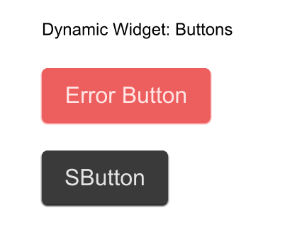

# SurrealismUI `ComponentSchema`

`export global ComponentSchema {}`

ComponentSchema is a global which can export all default `SurrealismUI` widget prop

you can use this global to generate half dyn widget

## Example



In this example, we use `SButtonProps` to make a `error-btn` and then send into `DynWidget`.
Since `SButtonProps` is a property description of `SButton`, `SButton` can use the passed in properties to change its own properties at will

It can let you change widget props easily when use Rust, C++, JS

```rust
import { ComponentSchema } from "../../../themes/index.slint";
import { SButtonProps, Themes } from "../../../use/index.slint";
import { SButton } from "../../../index.slint";


component DynWidget {
    in property <[SButtonProps]> btns;
    
    VerticalLayout {
      spacing: 20px;
      Text{
        text: "Dynamic Widget: Buttons";
      }
      for btn in btns: SButton {
        text: btn.text;
        theme: btn.theme;
      }
    }
}


export component TestDyn inherits Window {
  height: 400px;
  width: 400px;
  in property <SButtonProps> error-btn: {
    text:"Error Button",
    theme: Themes.Error
  };
  DynWidget {
    btns: [
      error-btn,
      ComponentSchema.button,
    ];
  }
}


```