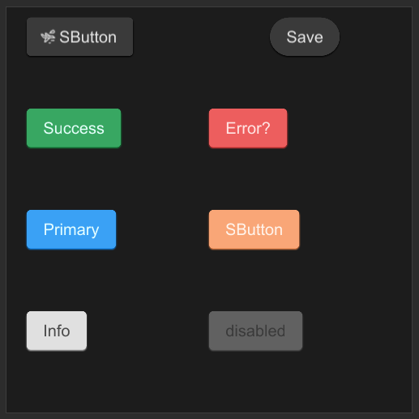

# SButton

SButton is a button component that you can freely perform regular properties operations on



## properties inherits SCard

- in property <image> icon : button icon in the left;
- in property <bool> show-icon : show icon or not;
- out property <bool> has-hover : hover button or not;
- in-out property <string> text : text display in button;
- in property <length> letter-spacing : text letter-spacing;
- in property <bool> round  : button is round or not;
- in-out property <bool> disabled : disabled to click

## functions

## callbacks 

- clicked : run if you click the button

## example

```rust
import {SButton} from "../../index.slint";
import {Themes} from "../../use/index.slint";

component TestButton inherits Window {
    height: 400px;
    width: 400px;
    SButton {
        x: 20px;
        y: 10px;
        show-icon: true;
        theme: Themes.Dark;
        icon: @image-url("../../icons/acceleration.svg");
        clicked => {
            self.text = "clicked"
        }
    }

    SButton {
        x: 260px;
        y: 10px;
        round: true;
        text: "Save";
        clicked => {
            self.text = "clicked";
        }
    }

    SButton {
        x: 20px;
        y: 100px;
        text: "Success";
        theme: Themes.Success;
    }

    SButton {
        x: 20px;
        y: 200px;
        text: "Primary";
        theme: Themes.Primary;
    }

    SButton {
        x: 20px;
        y: 300px;
        text: "Info";
        theme: Themes.Info;
    }

    SButton {
        x: 200px;
        y: 100px;
        text: "Error?";
        theme: Themes.Error;
        icon: @image-url("../../icons/magic-hat.svg");
    }

    SButton {
        x: 200px;
        y: 200px;
        theme: Themes.Warning;
    }

    SButton {
        x: 200px;
        y: 300px;
        text: "disabled";
        disabled: true;
        theme: Dark;
        clicked => {
            debug("cannot clicked")
        }
        pending => {
            debug("pending")
        }
    }
}
```

