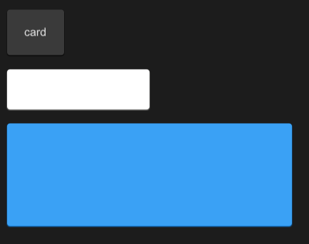

# SCard
A very simple universal card without any layout or restrictions

you can add anything you want to the card



## properties inherits Rectangle
- in property <Themes> theme : Surrealism theme;
- in property <length> card-height: card height (not contain padding);
- in property <length> card-width: card width (not contain padding);
- in property <PaddingType> padding-type : padding type;
- in property <ShadowType> shadow-type : shadow type;
- in property <BorderType> border-type : border type;
- in property <int> font-weight : font weight;
- in property <length> font-size: font size;
- in property <brush> font-color : font color;
- in property <bool> font-italic : font italic;
- in property <string> font-family : font family;
- in-out property <PaddingProps> card-padding : inner card padding struct;
- in-out property <BorderProps> card-border : inner card border struct;
- in-out property <ShadowProps> card-shadow : inner card shadow struct;
## example

```rust
import {SButton,SCard,SText} from "../../index.slint";
import {Themes} from "../../use/index.slint";


export component TestCard inherits Window {
  height: 400px;
  width: 600px;
  VerticalLayout {
    padding: 20px;
    spacing: 20px;
    SCard {
      SText {
        text: "card";
      }
    }
    SCard {
      card-height: 36px;
      card-width: 168px;
      theme: Light;
    }
    SCard {
      card-height: 124px;
      width: 400px;
      theme: Primary;
    }
  }
}
```