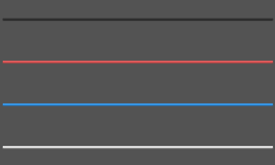

# SDivider

A divider groups sections of content to create visual rhythm and hierarchy.
 
Use dividers along with spacing and headers to organize content in your layout. 



## properties inherits SCard
## functions
## callbacks
## exmaple
```rust
import {SDivider} from "../../index.slint";
import {Themes} from "../../use/index.slint";
component TestDivider inherits Window {
  height: 400px;
  width: 400px;
  background: #535353;
  
  SDivider {
    y: 60px;
    width: 380px;
  }
  SDivider {
    y: 120px;
    width: 380px;
    theme:Themes.Error;
  }
  SDivider {
    y: 180px;
    width: 380px;
    theme:Themes.Primary;
  }
  SDivider {
    y: 240px;
    width: 380px;
    theme:Themes.Light;
  }
}
```