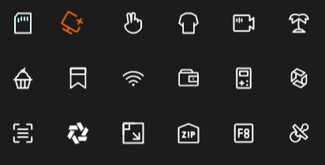

# SIcon

this is a icon container, better than Image



## properties:

- `in property <MouseCursor> mouse-cursor` : mouse cursor of the icon
- `in property <Themes> theme` : SurrealismUI themes
- `in property <image> source` : icon source
- `in-out property <brush> colorize` : icon color
- `in property <ImageFit> image-fit` : icon image fit
- `in property <ImageRendering> image-rendering` : image rendering
- `in-out property <RotationProps> rotation` : image rotation 
- `in property <int> source-clip-x` : icon clip x
- `in property <int> source-clip-y` : icon clip y
- `in property <int> source-clip-height` : icon clip height
- `in property <int> source-clip-width` : icon clip width
- `out property <bool> has-hover` : icon has hover

## functions

- `pure public function get-colorize()->brush` : get icon color

## callbacks: 
- `callback clicked` : run if you click the icon

## example

```rust
SIcon{
    height: 30px;
    width: 30px;
    colorize: self.get-colorize();
    source: @image-url("../../icons/sd-card.svg");
    theme: Themes.Primary;
}
```