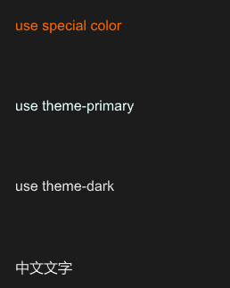

# SText

It is the simplest and most common component in SurrealismUI

It can display text , SText inherits Text and add theme property



## properties inherits Text

- `in property <Themes> theme` : Surrealism themes

## callbacks: 

## functions:

- `pure public function get()->string` : get content
- `public function set(content:string)` : set content

## example

```rust
import {SText} from "../../index.slint";
import {Themes} from "../../use/index.slint";


component TestText inherits Window {
  height: 400px;
  width: 400px;
  VerticalLayout {
    padding: 20px;
    SText {
      color: #f60;
      text: "use special color";
    }
    SText {
      theme: Primary;
      text: "use theme-primary";
    }
    SText {
      theme: Dark;
      text: "use theme-dark";
    }
    SText {
      text: "中文文字";
    }
  }
}
```