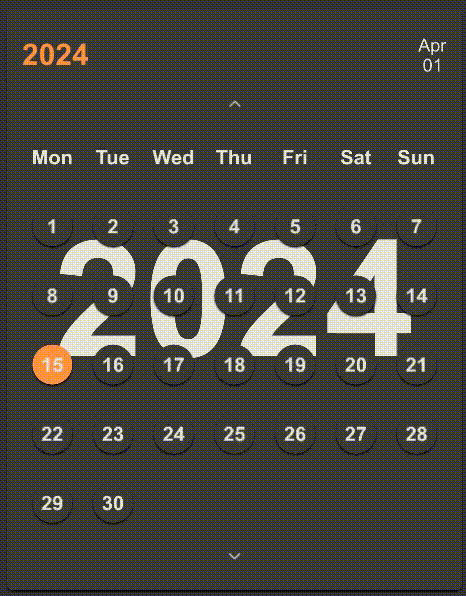

# SCalendar

A calendar component that inherits from SCard. It is designed to display a month view with the ability to navigate and select dates.



## Example

### normal

```rust
import {SCalendar} from "../../index.slint";
component TestCalendar inherits Window {
    height: 500px;
    width: 400px;
    background: #333;
    VerticalLayout {
        padding: 16px;
        SCalendar {
            bg-visible: false;
            theme: Dark;
            height: 464px;
            width: 364px;
        }
    }
}

```

## define

```rust
component TestCalendar2 inherits Window {
    height: 500px;
    width: 700px;
    background: #333;
    VerticalLayout {
        padding: 16px;
        SCalendar {
            bg-visible: true;
            theme: Info;
            height: 464px;
            width: 664px;
            months: [
                "一月","二月","三月","四月","五月","六月",
                "七月","八月","九月","十月","十一月","十二月"
            ];
            today: {
                year: 2024,
                month: 1,
                day: 1,
            };
            weekdays: [
                "周日","周一","周二","周三","周四","周五","周六"
            ];
        }
    }
}
```

## Properties
- `in-out property <SDate> today`: Represents today's date.
- `in property <bool> bg-visible`: Linked with the visibility of the background.
- `in-out property <SDate> active-date`: Currently active date, synchronized with today's date by default.
- `in-out property <SDate> current-date`: The date currently displayed on the calendar, also synchronized with today's date by default.
- `in-out property <[string]> months`: List of month names, default values fetched from `DefaultSCalendarProps.months`.
- `in-out property <[string]> weekdays`: List of weekday names, default values fetched from `DefaultSCalendarProps.weekdays`.

## Functions
- `pure function fmt(v: int)`: Formats a given integer to a string, adding a leading zero if the integer is less than 10.
- `pure function get-line-length(index: int)`: Calculates the number of days to display in a given week row of the calendar view.
- `pure function get-day(item: int, index: int)`: Calculates the actual day number to be displayed for a given position in the calendar.
- `pure function get-line-num()`: Computes the total number of lines (weeks) required to display the current month in the calendar view.
- `function update()`: Updates the leap year status, the number of days in the current month, and adjusts the weekdays for start and end of the month based on any change in the current date.

## Callbacks
- `callback up(SDate)`: Triggered when the user navigates to the previous month or year.
- `callback down(SDate)`: Triggered when the user navigates to the next month or year.
- `callback change(SDate)`: Called when a new date is selected or changed in the calendar.