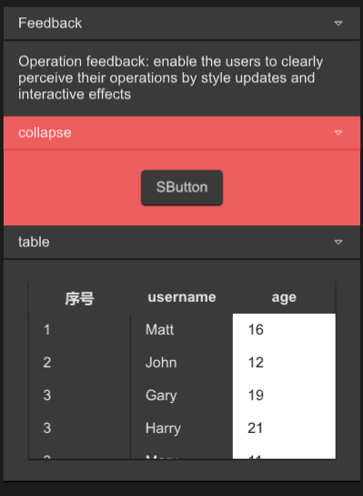

# SCollapse

SCollapse is a foldable panel

This is the outter of the Collapse, what really works is SCollapseItem

The outter only serves as a standard layout , this is a zero cost construction



## example

```rust
import {SCollapse,SCollapseItem,SButton,STable,STableColumn} from "../../index.slint";
import { UseIcons,Themes } from "../../use/index.slint";
import { SText } from "../../src/text/index.slint";

component TestWindow inherits Window {
  height: 600px;
  width: 400px;
  SCollapse {
    y: 10px;
    // you can set 0 , it has no impact
    // recommend use the following way
    height: item1.get-height() * 3;
    width: 360px;
    item1:=SCollapseItem {
      header-title:"Feedback";
      SText {
        wrap: word-wrap;
        height: item1.details-height;
        width: item1.width;
        text:"Operation feedback: enable the users to clearly perceive their operations by style updates and interactive effects";
      }
    }
    SCollapseItem {
      theme: Themes.Error;
      
      SButton { 

      }
    }
    SCollapseItem {
      header-title:"table";
      theme: Themes.Dark;
      details-height:280px;
      STable{
        theme: Dark;
        width: 86%;
        height: 80%;
        column-themes:[Themes.Dark,Themes.Dark,Themes.Dark];
        viewport-height: col1.height;
        alignment: center;
        columns: [
          {label:"序号",value:"$index"},
          {label:"username",value:"name"},
          {label:"age",value:"age"},
        ];
        clicked(index,item)=>{
          debug(index);
          debug(item);
        }
        
        col1:=STableColumn {
          alignment: left;
          datas:[
            "1",
            "2",
            "3",
            "3",
            "3",
          ];
          width: parent.get-column-width(parent.width , 0);
        }
        STableColumn {
          index:1;
          width: parent.get-column-width(parent.width , 1);
          datas:[
            "Matt",
            "John",
            "Gary",
            "Harry",
            "Mary",
          ];
          clicked(col-index,index,value)=>{
            debug(col-index);
            debug(index);
            debug(value);
          }
        }
        STableColumn {
          theme: Light;
          width: parent.get-column-width(parent.width , 2);
          datas:[
            "16",
            "12",
            "19",
            "21",
            "11",
          ];
        }
      }
    }
  }
  
}
```

## properties inherits Rectangle

***
## SCollapseItem
SCollapseItem is a component of SCollapse, without which SCollapse will not work

You can customize the components or use the default text display method in it
### properties
- in-out property <int> font-weight : font weight
- in-out property <length> font-size: font size
- in-out property <brush> font-color : font color
- in-out property <bool> font-italic : font italic
- in-out property <string> font-family : font family
- in-out property <Themes> theme : SurrealismUI theme
- in-out property <length> header-height : collapse header height
- in-out property <string> header-title : collapse header title
- in-out property <PaddingType> header-padding-type: collapse header padding type
- in-out property <ShadowType> header-shadow-type: collapse header shadow type
- in-out property <BorderType> header-border-type : collapse header border type
- in-out property <length> details-height : collapse detail height
- in-out property <PaddingType> details-padding-type: collapse detail padding type
- in-out property <ShadowType> details-shadow-type: collapse detail shadow type
- in-out property <BorderType> details-border-type : collapse detail border type
- in-out property <bool> is-show : the collapse detail is show or not;
- in-out property <image> collapse-icon : collapse header expand icon
### functions
- pure public function get-height()->length : get collapse header height
### callbacks
- callback clicked() : run if you show collapse detail