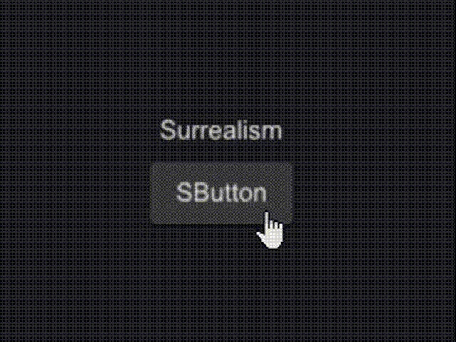

# SCollection

SCollection is an expandable box that can be zoomed in or out by clicking (internal can also be used)



## examples
```rust
import {SButton,SCollection, SText} from "../../index.slint";
import {Themes} from "../../use/index.slint";

component TestCollection inherits Window {
  height: 600px;
  width: 600px;
  
  c:=SCollection{
    height: 180px;
    width: 180px;
    scale : 3;
    clicked => {
      txt.font-size = self.toggle(txt.font-size,1.5);
      btn.width = self.toggle(btn.width , 1.6);
      btn.theme = c.is-scale ? Themes.Dark : Themes.Error;
    }
    VerticalLayout {
      padding: 20px;
      spacing: 20px;
      alignment: center;
      Rectangle {
        txt:=SText {
          text:"Surrealism";
        }
      }
      Rectangle {
        btn:=SButton{
        }
      }
    }
  }
}
```
## properties (card)
- in property <float> scale : collection scale size;
- in-out property <bool> is-scale : collection is scale or not;
- in property <easing> easing : animation easing type;
- in property <duration> duration : animation duration;
## functions
- pure public function toggle-default(target:length)->length
- pure public function toggle(target:length,scale-size:float)->length
## callbacks
- clicked() : run if you click item in SCollection