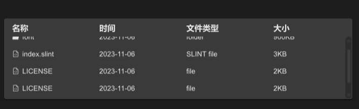

# SFile
SFile can help users present file selectors GUI


## example
```rust
import {SFile} from "../../index.slint";
import { Themes,PaddingType,UseIcons,FileItem} from "../../use/index.slint";

export component TestFile inherits Window {
  height: 400px;
  width: 800px;
  SFile{
    theme: Dark;
    width: 86%;
    height: 40%;
    item-font-size: 14px;
    tabs: [
      {label:"名称",value:"name"},
      {label:"时间",value:"dateTime"},
      {label:"文件类型",value:"file-type"},
      {label:"大小",value:"size"}
    ];
    files : [
      {icon:UseIcons.icons.Folder-filled , name : "font" , datetime : "2023-11-06" , file-type : "folder" , size : "900KB"},
      {icon:UseIcons.icons.FileCode , name : "index.slint" , datetime : "2023-11-06" , file-type : "SLINT file" , size : "3KB"},
      {icon:UseIcons.icons.FileCode , name : "LICENSE" , datetime : "2023-11-06" , file-type : "file" , size : "2KB"},
      {icon:UseIcons.icons.FileCode , name : "LICENSE" , datetime : "2023-11-06" , file-type : "file" , size : "2KB"},
      {icon:UseIcons.icons.FileCode , name : "LICENSE" , datetime : "2023-11-06" , file-type : "file" , size : "2KB"}
    ];
    tab-clicked(index,item)=>{
      debug(index);
      debug(item);
    }
    item-clicked(index,cindex,item)=>{
      debug(index);
      debug(cindex);
      debug(item);
    }
  }
}
```
## properties
- in property <TextHorizontalAlignment> text-alignment : file item horizontal alignment
- in property <[SOption]> tabs : file tabs
- in-out property <[length]> column-width : file item column width
- in-out property <[FileItem]> files : file item font files
- in-out property <string> item-font-family : file item font family
- in-out property <int> item-font-weight : file item font weight
- in-out property <length> item-font-size: file item font size
- in-out property <bool> item-font-italic : file item font italic
- in-out property <PaddingType> item-padding-type: file item padding type
## functions
- pure function get-column-width(w:length,index:int)->length : get file item column width
## callbacks
- callback tab-clicked(int,SOption) : run if you click the tab
- callback item-clicked(int,int,FileItem) : run if you click a file item
