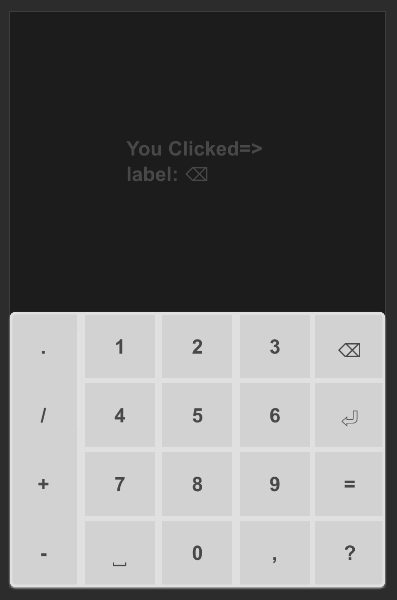
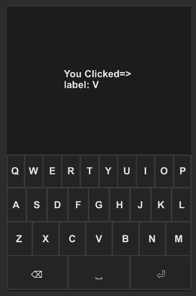
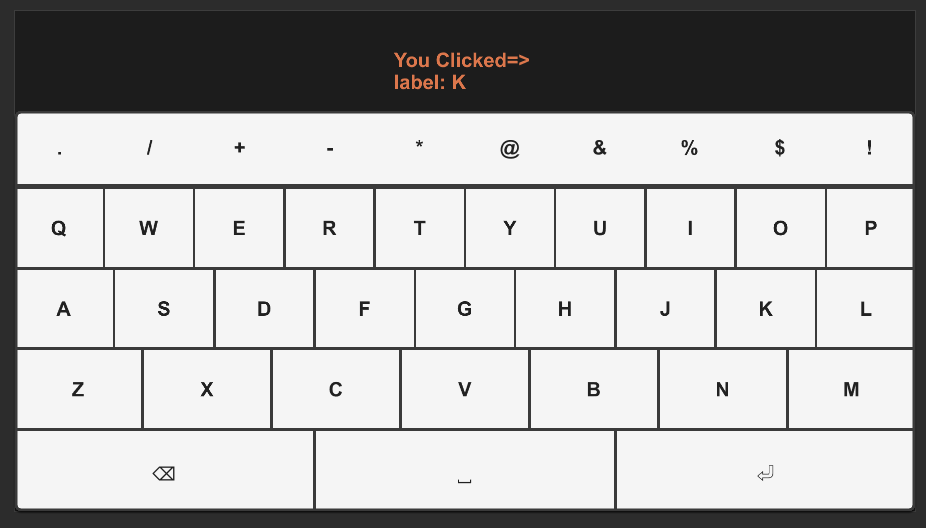

# SKeyBoard
A customizable keyboard component for various input types including numbers, alphabets, and computer keyboard layouts.

## examples

### Number



```rust
import {SText,SCard, SKeyBoard} from "../../index.slint";
import { KeyBoardType } from "../../use/index.slint";

component TestKeyBoardNumber {
    height: 460px;
    width: 300px;
    t:= SText {
        y: 100px;
        theme: kb.theme;
        font-weight: 700;
        text: "Click Keyboard !";
    }
    SCard {
        y: root.height - self.height;
        card-height: 200px;
        width: 100%;
        theme: Info;
        kb:= SKeyBoard {
            theme: parent.theme;
            keyboard-type: KeyBoardType.PhoneNumber;
            clicked(key) =>{
                t.text = @tr("You Clicked=> \nlabel: {}\n",key.label);
                // See enum KeyItems
                debug(key.value);
            }
        }
    }
}

```

### Alpha



```rust
import {SText,SCard, SKeyBoard} from "../../index.slint";
import { KeyBoardType } from "../../use/index.slint";

component TestKeyBoardAlpha {
    height: 460px;
    width: 300px;
    t:= SText {
        y: 100px;
        theme: kb.theme;
        font-weight: 700;
        wrap: word-wrap;
        text: "Click Keyboard !";
    }
    
    SCard {
        y: root.height - self.height;
        card-height: 200px;
        width: 100%;
        theme: Dark;
        kb:= SKeyBoard { 
            theme: parent.theme;
            keyboard-type: KeyBoardType.PhoneAlpha;
            clicked(key) =>{
                t.text = @tr("You Clicked=> \nlabel: {}\n",key.label);
                // See enum KeyItems
                debug(key.value);
            }
        }
    }
    
}

```

### All



```rust
import {SText,SCard, SKeyBoard} from "../../index.slint";
import { KeyBoardType } from "../../use/index.slint";

component TestKeyBoardAll {
    height: 400px;
    width: 720px;
    t:= SText {
        y: 30px;
        theme: kb.theme;
        color: #dc774c;
        font-weight: 700;
        wrap: word-wrap;
        text: "Click Keyboard !";
    }
    
    SCard {
        y: root.height - self.height;
        card-height: 300px;
        width: 100%;
        theme: Dark;
        kb:= SKeyBoard { 
            theme: Light;
            keyboard-type: KeyBoardType.Computer;
            clicked(key) =>{
                t.text = @tr("You Clicked=> \nlabel: {}\n",key.label);
                // See enum KeyItems
                debug(key.value);
            }
        }
    }
}

```

## Properties
- in property <Themes> theme: Themes.Dark; The theme of the keyboard, defaulting to dark mode.
- in property <length> font-size: 16px; The font size used in the keyboard.
- in-out property <KeyBoardType> keyboard-type: KeyBoardType.PhoneNumber; The type of keyboard layout (e.g., phone number, phone alphabet, computer).
## Callbacks
- callback clicked(SKeyItem): Triggered when a key is clicked, returning the key item clicked.
