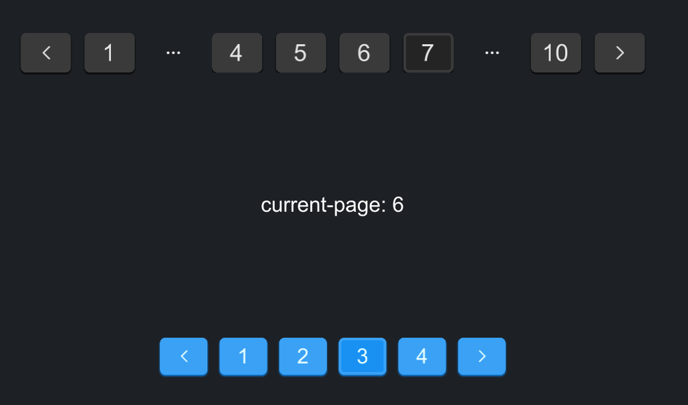

# SPagination
A component designed for navigating through pages, providing options for customization and various interactions.



## example
```rust
import { SPagination } from "../../index.slint";
import {Themes,UseIcons} from "../../use/index.slint";
export component TestPagination inherits Window {
    height: 400px;
    width: 560px;
    background: #1d2125;
    VerticalLayout {
        padding-top: 32px;
        padding-bottom: 32px;
        alignment: space-around;
        Rectangle {
            a := SPagination {
                page-size: 10;
                total: 100;
                visible-range: 6;
            }
        }

        Rectangle {
            Text {
                // current-page is index
                text: @tr("current-page: {}",a.active);
                font-size: 16px;
                color: #fff;
            }
        }

        Rectangle {
            p := SPagination {
                theme: Themes.Primary;
                active: 2;
                page-size: 30;
                total: 100;
                pre-icon: @image-url("../../icons/to-left.svg");
                size: 16px;
                next-icon: @image-url("../../icons/to-right.svg");
            }
        }
    }
}

```
## Properties
- in property <Themes> theme: Themes.Dark; Specifies the theme of the pagination component, with a default of dark mode.
- in-out property <int> active: 0; The current active page.
- in property <int> page-size: 10; The number of items per page.
- in property <int> total: 50; The total number of items across all pages.
- in property <image> pre-icon: UseIcons.icons.Left; The icon used for the "previous page" button.
- in property <image> next-icon: UseIcons.icons.Right; The icon used for the "next page" button.
- in property <length> size: 18px; The size of the pagination component.
- in property <int> visible-range: 5; The number of visible page buttons in the pagination component.
## Functions
- pure function get-color(hover: bool, index: int, self-color: brush) -> brush; Determines the color of page buttons based on the hover state and if it's the active page.
- pure function to-left() -> bool; Determines if the "move to left" action should be available based on the current active page and the total number of pages.
- pure function to-right() -> bool; Determines if the "move to right" action should be available based on the current active page and the total number of pages.
## Callbacks
- callback pre(int, int); Triggered when the "previous page" button is clicked.
- callback next(int, int); Triggered when the "next page" button is clicked.
- callback clicked(int, int); Triggered when a specific page number is clicked.
