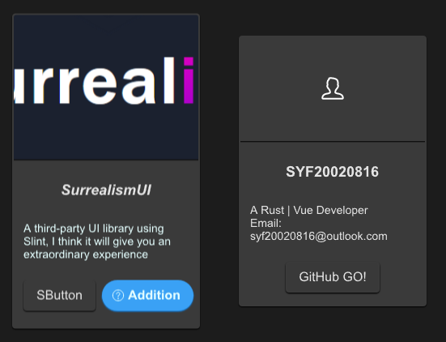

# SPersona

This component is used to display simple user introduction information



## example
```rust
import {SPersona} from "../../index.slint";
import {Themes,UseIcons} from "../../use/index.slint";
import { ComponentSchema,DefaultSButtonProps } from "../../themes/index.slint";

component TestPersona inherits Window {
  height: 500px;
  width: 600px;
  SPersona {
    x: 20px;
    avatar: @image-url("../../README/imgs/logo.png");
    avatar-height: 180px;
    name: "SurrealismUI";
    name-font-italic: true;
    name-font-weight: 900;
    des: @tr("A third-party UI library using Slint, I think it will give you an extraordinary experience");
    des-font-size: 14px;
    des-theme: Primary;
    btns: [
      ComponentSchema.button,
      {
        font-weight :700,
        font-size : DefaultSButtonProps.font-size,
        color : DefaultSButtonProps.color,
        font-italic : DefaultSButtonProps.font-italic,
        font-family : DefaultSButtonProps.font-family,
        theme : Themes.Primary,
        padding-type : DefaultSButtonProps.padding-type,
        shadow-type : DefaultSButtonProps.shadow-type,
        border-type : DefaultSButtonProps.border-type,
        icon :  UseIcons.icons.Help,
        show-icon : true,
        text : "Addition",
        letter-spacing : DefaultSButtonProps.letter-spacing,
        clip :DefaultSButtonProps.clip,
        round : true
      }
    ];
    clicked(e) => {
      debug(e);
    }
  }
  SPersona {
    x: 300px;
    btn-text: "GitHub GO!";
  }
}
```
## properties inherits SCard
- in-out property <string> btn-text : button text
- in property <length> spacing : spacing of persona 
- in property <[SButtonProps]> btns : buttons slot
- in property <image> avatar : persona avatar image
- in property <length> avatar-height: persona avatar height
- in property <Themes> avatar-theme : persona avatar theme
- in-out property <string> name : persona name
- in-out property <length> name-height: persona name height
- in-out property <length> name-font-size: persona name font size
- in-out property <int> name-font-weight : persona name font weight
- in-out property <Themes> name-theme: persona name theme
- in-out property <string> name-font-family : persona name font family
- in-out property <bool> name-font-italic : persona name font italic
- in-out property <string> des : persona description text
- in-out property <length> des-height: persona description height
- in-out property <length> des-font-size: persona description font size
- in-out property <int> des-font-weight : persona description font weight
- in-out property <Themes> des-theme: persona description theme
- in-out property <string> des-font-family : persona description font family
- in-out property <bool> des-font-italic : persona description font italic
## functions
## callbacks
- callback clicked(SButtonProps): run if you click the buttons
