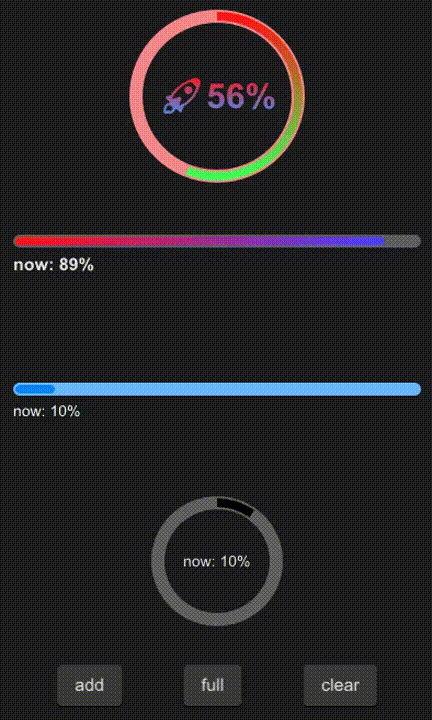

# SProgress

SProgress is commonly used to display download progress or event processing progress
And you can fully control it through the progress property



## example
```rust
import {SProgress,SButton} from "../../index.slint";
import {Themes} from "../../use/index.slint";

component TestProgress inherits Window {
  height: 680px;
  width: 400px;

  VerticalLayout {
    spacing: 20px;
    padding: 10px;
    SProgress {
      theme: Error;
      height: 160px;
      circle: true;
      progress: 56%;
      font-size: 32px;
      font-weight: 700;
      stroke-color: @linear-gradient(180deg, #ff1515 0%,  #41ff57 100%);
      text: @tr("🚀{}%",round(self.progress * 100));
      font-color: @linear-gradient(180deg, #ff1515 0%,  #4193ff 100%);
    }
    SProgress {
      height: 100px;
      circle: false;
      progress: 89%;
      font-size: 16px;
      font-weight: 700;
      stroke-color: @linear-gradient(90deg, #ff1515 0%,  #4741ff 100%);
    }
    b:= SProgress {
      theme: Primary;
      circle: false;
      progress: 10%;
    }
    a:= SProgress {
      height: 120px;
      circle: true;
      progress: 10%;
    }
    HorizontalLayout {
      padding: 16px;
      alignment: space-around;
      SButton{
        text: "add";
        clicked => {
          a.add(0.1);
          b.add(0.1);
        }
      }
      SButton{
        text: "full";
        clicked => {
          a.full();
          b.full();
        }
      }
      SButton{
        text: "clear";
        clicked => {
          a.clear();
          b.clear();
        }
      }
    }
  }
  
}
```
## properties inherits Rectangle
- in property <Themes> theme : progress theme
- in property <string> text : display text
- in-out property <length> stroke-width : stroke width
- in-out property <brush> stroke-color : color of the progress
- in-out property <float> progress : progress value
- in-out property <int> font-weight : display text font weight
- in-out property <length> font-size: display text font size
- in-out property <brush> font-color : display text font color
- in-out property <bool> font-italic : display text font italic
- in-out property <string> font-family : display text font family
- in property <bool> circle: use circle progress
## functions
- pure public function get-progress() : get timely progress
- public function full() : make progress 100%
- public function clear() : : make progress 0%
- public function add(num:float) : increase progress
## callbacks
