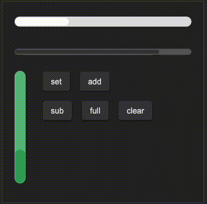

# SSlider
The Slider component is used for creating a slider control that allows users to select a value within a range. It supports customization of orientation, theme, and visual properties.


## example
```rust
import {SSlider, SButton} from "../../index.slint";


component TestSlider inherits Window{
    height: 400px;
    width: 400px;
    VerticalLayout {
        spacing: 20px;
        padding: 20px;
        SSlider {
            theme: Light;
            width: 360px;
            height: 40px;
            stroke-width: 16px;
            progress: 0.3;
        }
        SSlider {
            width: 360px;
            height: 40px;
            progress: 80%;
        }

        HorizontalLayout {
            spacing: 30px;
            slider:= SSlider {
                theme: Success;
                width: 30px;
                height: 220px;
                stroke-width: 220px;
                progress: 30%;
                orientation: Orientation.vertical;
                moved(progress) => {
                    debug(progress);
                }
            }
            VerticalLayout {
                spacing: 20px;
                HorizontalLayout {
                    spacing: 20px;
                    SButton{
                        text: "set";
                        clicked => {
                            slider.set(0.45);
                        }
                    }
                    SButton{
                        text: "add";
                        clicked => {
                            slider.add(0.1);
                        }
                    }
                }
                HorizontalLayout {
                    spacing: 20px;
                    SButton{
                        text: "sub";
                        clicked => {
                            slider.sub(0.1);
                        }
                    }
                    SButton{
                        text: "full";
                        clicked => {
                            slider.full();
                        }
                    }
                    SButton{
                        text: "clear";
                        clicked => {
                            slider.clear();
                        }
                    }
                }
            }
        }
    }
}
```

## properties
- `in property <Orientation> orientation` :  Sets the orientation of the slider.
- `in property <Themes> theme` :  Sets the theme of the slider.
- `in-out property <float> progress` :  Controls the progress value of the slider.
- `in-out property <length> stroke-width` :  Sets the stroke width of the slider.
- `in-out property <brush> stroke-color` :  Sets the stroke color of the slider.
- `in property <length> border-radius` :  Sets the border radius of the slider bar, linked to bar.border-radius.
## functions
- `public function set(progress: float)` : Sets the slider progress to a specific value and triggers the moved callback.
- `public function add(len: float)` : Increases the slider progress by a specified value and triggers the moved callback.
- `public function sub(len: float)` : Decreases the slider progress by a specified value and triggers the moved callback.
- `public function full()` : Sets the slider progress to 1 (full) and triggers the moved callback.
- `public function clear()` : Sets the slider progress to 0 (empty) and triggers the moved callback.
## callbacks
- `callback moved(float)` : Triggered when the slider is moved, passing the current progress value as a float.