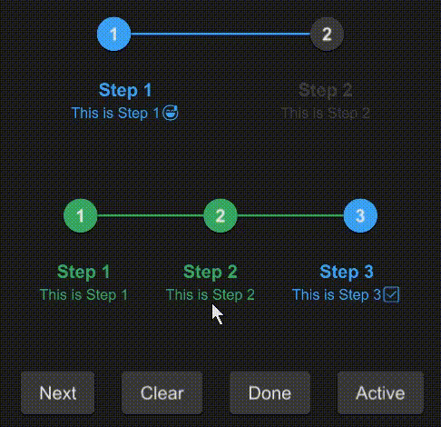

# SStep

The Step component visualizes the progress of a sequence by breaking it down into individual steps. It allows for custom theming and supports indicating the current, completed, and pending steps through visual cues.



## example
```rust
import { SButton,SStep } from "../../index.slint";
component TestStep {
  height: 400px;
  width: 400px;
  VerticalLayout {
    padding: 24px;
    spacing: 60px;
    SStep {
      active: 1;
      height: 100px;
      font-size: 16px;
      options: [
        {
          label: "Step 1",
          value: "1",
          info: "This is Step 1😅",
        },
        {
          label: "Step 2",
          value: "2",
          info: "This is Step 2",
        },
      ];
    }
    s:= SStep {
      height: 100px;
      font-size: 16px;
      active: 3;
      options: [
        {
          label: "Step 1",
          value: "1",
          info: "This is Step 1",
        },
        {
          label: "Step 2",
          value: "2",
          info: "This is Step 2",
        },
        {
          label: "Step 3",
          value: "3",
          info: "This is Step 3✅",
        }
      ];
    }
    HorizontalLayout {
      spacing: 24px;
      SButton {
        text: "Next";
        clicked => {
          s.next();
        }
      }
      SButton {
        text: "Clear";
        clicked => {
          s.clear();
        }
      }
      SButton {
        text: "Done";
        clicked => {
          s.done();
        }
      }
      SButton {
        text: "Active";
        clicked => {
          debug(s.get-active());
        }
      }
    }
  }
}
```
## Properties
- in property <Themes> theme : The theme setting for the step component, defaulting to Dark.
- in-out property <length> font-size : The font size used for step labels.
- in-out property <int> font-weight : The font weight for step labels.
- in-out property <bool> font-italic : Specifies whether the font for step labels is italic.
- in-out property <string> font-family : The font family for step labels.
- in-out property <brush> font-color : The color of the font used for step labels.
- in-out property <int> active : The index of the currently active step.
- in property <brush> active-color : The color indicating an active step.
- in property <brush> done-color : The color indicating a completed step.
- in property <brush> undone-color : The color indicating a pending step.
- in property <[SStepOption]> options : An array of step options defining the sequence of steps.
## Functions
- public function next() : Advances the active step by one, unless it's the last step.
- public function clear() : Resets the active step to the first step.
- public function done() : Marks all steps as completed by setting the active step beyond the last step.
- pure public function get-active() -> int : Returns the index of the currently active step.
- pure function count-align(index:int) -> LayoutAlignment : Determines the alignment of a step based on its index in the sequence.
- pure function status-color(index:int) -> brush : Returns the color that should be used for a step at the given index based on its status (active, done, or undone).
