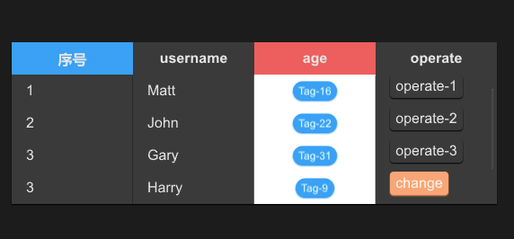

# STable
In fact, it is just the header of the table and needs to be used together with `STableColumn` or `STableColumnFlex`



## example
```rust
import {STable,STableColumn, SCard,STableColumnItem,STableColumnFlex, SButton} from "../../index.slint";
import {Themes,PaddingType,ShadowType,BorderType,PaddingProps,BorderProps,ShadowProps,UseSurrealismFn} from "../../use/index.slint";
import { ROOT-STYLES,DefaultSCardProps,ComponentSchema } from "../../themes/index.slint";
import { ScrollView } from "std-widgets.slint";
import { STag } from "../../src/tag/index.slint";


export component TestTable inherits Window {
  height: 500px;
  width: 600px;
  STable{
    theme: Dark;
    width: 90%;
    height: 36%;
    column-themes:[Themes.Primary,Themes.Dark,Themes.Error,Themes.Dark];
    viewport-height:col1.height;
    alignment: center;
    columns: [
      {label:"序号",value:"$index"},
      {label:"username",value:"name"},
      {label:"age",value:"age"},
      {label:"operate",value:"opt"},
    ];
    clicked(index,item)=>{
      debug(index);
      debug(item);
    }
    
    col1:=STableColumn {
      alignment: left;
      datas:[
        "1",
        "2",
        "3",
        "3",
        "3",
      ];
      width: parent.get-column-width(parent.width , 0);
    }
    STableColumn {
      index:1;
      width: parent.get-column-width(parent.width , 1);
      datas:[
        "Matt",
        "John",
        "Gary",
        "Harry",
        "Mary",
      ];
      clicked(col-index,index,value)=>{
        debug(col-index);
        debug(index);
        debug(value);
      }
    }
    STableColumnFlex {
      index: 2;
      theme: Light;
      width: parent.get-column-width(parent.width , 2);
      height: self.count-column-height(5);
      
      for item[index] in ["16","22","31","9","18"]: STableColumnItem {
        theme: parent.theme;
        height: parent.height / 5;
        callback row-click(string);
        clicked => {
          self.row-click(item);
        }
        row-click(row-item) => {
          debug(row-item);
        }
        Rectangle {
          STag {
            text: @tr("Tag-{}",item);
            theme: Primary;
          }
        }
      }
    }
    STableColumnFlex {
      index: 3;
      theme: Dark;
      width: parent.get-column-width(parent.width , 3);
      height: self.count-column-height(5);
      for item[index] in ["1","2","3"]: STableColumnItem {
        height: parent.height / 5;
        SButton {
          text: @tr("operate-{}",item);
          padding-type: PaddingType.Tag;
        }
      }
      for item[index] in ["change","delete"]: STableColumnItem {
        height: parent.height / 5;
        SButton {
          theme: Warning;
          text: item;
          padding-type: PaddingType.Tag;
          clicked => {
            debug("I am click!");
          }
        }
      }
    }
  }
}
```
## properties inherits SCard
- in property <[Themes]> column-themes: table header columns' theme;
- in property <length> viewport-height: table body viewport height
- in property <TextHorizontalAlignment> alignment : table header horizontal alignment
- in property <[SOption]> columns : table columns
- in-out property <[length]> column-width : table column width
## functions
- pure public function get-column-width(w:length,index:int)->length : get each column width depand on the index
## callbacks
- callback clicked(int,SOption) : run if click the Table Header

***
## `STableColumn` 简单表格列
It is table body , it covers the data of the table , It is easy for just show text in Table
### properties inherits SCard
- in-out property <int> index : column index
- in property <[string]> datas : column datas
- in property <TextHorizontalAlignment> alignment : row text horizontal alignment
### functions
- pure public function count-column-height()->length : count column height
### callbacks
- callback clicked(int,int,string) : run if click the row item
## `STableColumnFlex` 灵活表格列 inherits `STableColumn`
It is also a kind of table body , but this component is more flexible ,  you can use with `STableColumnItem` together and define what will show in the table
## `STableColumnItem` 表格单元格
It is a component used to describe a cell in a table , It can help you define tables more easily.