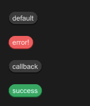

# STag
A small tag used to display data



## properties inherits SCard

- in property <string> text : text in tag

## functions

- pure public function get() -> string : get tag text
- public function set(value:string) : set tag text

## callbacks
- callback clicked(string) : run if you click the tag

## example

```rust
import {STag} from "../../index.slint";
import {Themes} from "../../use/index.slint";

component TestWindow inherits Window {
  height: 400px;
  width: 400px;
  VerticalLayout {
    spacing: 20px;
    padding: 20px;
    STag {
      text:"default";
      clicked(text) => {
        debug(self.get());
        self.set(@tr("clicked -> {}",text));
      }
    }
    STag {
      text:"error!";
      theme:Themes.Error;
    }
    STag {
      text:"callback";
      theme:Themes.Dark;
      clicked(text)=>{
        self.font-color= #ddff00;
      }
    }
    STag {
      text:"success";
      theme:Themes.Success;
    }
  }
}
```