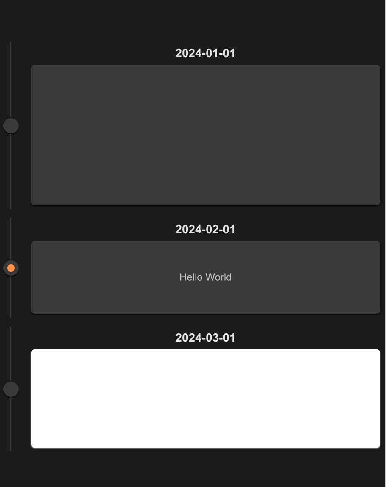

# STimeline
The timeline component is mainly used to display the changes of data over time, and it is usually used in data visualization to visually represent time series data


## example

```rust
import {SCard,STimeLine,STimeLineItem} from "../../index.slint";


component TestTimeLine {
    height: 600px;
    width: 460px;
    Text {}
    STimeLine {
        width: 100%;
        STimeLineItem {
            id: "001";
            width: parent.width;
            height: root.height / 3;
            theme: Dark;
            date: "2024-01-01";
            SCard {
                height: parent.center-height();
                width: parent.center-width();
            }
        }
        STimeLineItem {
            width: parent.width;
            height: root.height / 5;
            theme: Dark;
            date: "2024-02-01";
            SCard {
                height: parent.center-height();
                width: parent.center-width();
                Text {
                    color: #fff;
                    text: "Hello World";
                }
            }
            clicked => {
                self.active = !self.active;
            }
        }
        STimeLineItem {
            width: parent.width;
            height: root.height / 4;
            theme: Dark;
            date: "2024-03-01";
            SCard {
                theme: Light;
                height: parent.center-height();
                width: parent.center-width();
            }
            clicked(is_active) => {
                debug(is-active);
                self.active = !self.active;
            }
        }
    }
}
```

## STimeLine

The outer of Timeline

## STimeLineItem
### properties

- `in property <string> id`: timeline id
- `in property <Themes> theme`: SurrealismUI theme
- `in property <string> date`: the date of Timeline
- `in property <TextHorizontalAlignment> header-alignment`: date display alignment
- `in property <length> font-size`: font size
- `in-out property <bool> active`: is timeline item active or not

### functions

- `pure public function center-height() -> length`: get timeline center area height
- `pure public function center-width() -> length`: get timeline center area width

### callbacks

- `callback clicked(bool)`: is timeline item clicked or not