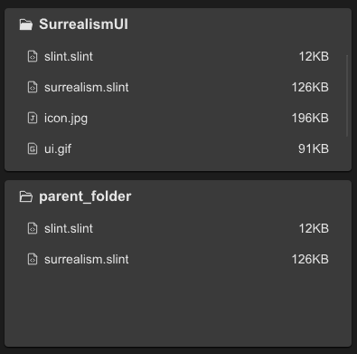

# STree
STree can be used to display directory structure, forming a parent-child relationship, and can be easily displayed


## example
```rust
import {STree } from "../../index.slint";
import {UseIcons} from "../../use/index.slint";

component TestTree inherits Window {
  height: 400px;
  width: 400px;
  STree{
    y: 10px;
    theme: Dark;
    height: 45%;
    width: 96%;
    tree-data:{
      icon : UseIcons.icons.Folder_filled,
      label: "SurrealismUI",
      extra:"",
      children:[
        {
          icon:UseIcons.icons.FileCode,
          label:"slint.slint",
          extra:"12KB", 
        },
        {
          icon:UseIcons.icons.FileCode,
          label:"surrealism.slint",
          extra:"126KB", 
        },
        {
          icon:@image-url("../../icons/file-jpg.svg"),
          label:"icon.jpg",
          extra:"196KB", 
        },
        {
          icon:@image-url("../../icons/file-gif.svg"),
          label:"ui.gif",
          extra:"91KB", 
        },
        {
          icon:@image-url("../../icons/file-gif.svg"),
          label:"ui2.gif",
          extra:"107KB", 
        }
      ]
    };
    clicked(i,n,e)=>{
      debug(n);
    }
  }
  STree {
    y: 200px;
    height: 46%;
    width: 96%;
  }
}
```
## properties inherits SCard
- in property <string> item-font-family : tree item font family
- in property <int> item-font-weight : tree item font weight
- in property <length> item-font-size: tree item font size
- in property <bool> item-font-italic : tree item font italic
- in-out property <TreeData> tree-data : tree data
## callbacks
- callback clicked(int,string,string) : run if you click an item
