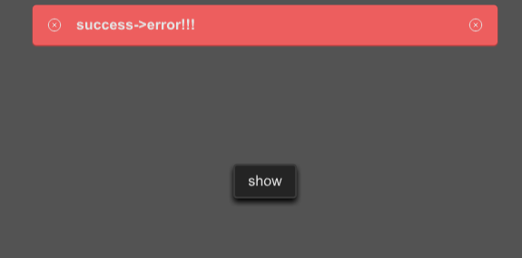

# SAlert
SAlert is used to display important prompt information on the page



## example
```rust
import {SButton, SAlert} from "../../index.slint";
import {ResultType,Themes,UseIcons} from "../../use/index.slint";

component TestAlert inherits Window {
  height: 400px;
  width: 600px;
  background: #535353;
 
  SButton {
    text: "show";
    clicked => {
      p.error("success->error!!!");
      
      debug("sds1")
    }
  }
 

  p:=SAlert { 
    result-type:ResultType.Success ;
    text:"this is a success message!";
  }
}
```
## properties
- in property <int> font-weight :font weight;
- in property <length> font-size: font size;
- in property <brush> font-color : font color;
- in property <bool> font-italic : font italic;
- in property <string> font-family : font family;
- in property <TextOverflow> overflow : text overflow;
- in property <length> spacing : spacing among icons and text in alert;
- in-out property <string> text : display text in alert;
- in-out property <bool> is-show : is alert show or not;
- in property <length> alert-height : alert height;
- in-out property <ResultType> result-type: the result type of the alert;
- in property <image> close-icon : close icon;
- in property <length> icon-size : icon size;
## functions
- public function open() : open alert
- public function close() : close alert
- public function success(text:string) : open success alert
- public function warning(text:string) : open warning alert
- public function error(text:string) : open error alert
- public function info(text:string) : open info alert
- public function help(text:string) : open help alert
- public function primary(text:string) : open primary alert 
