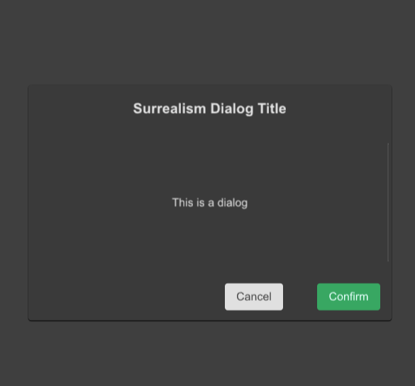

# SDialog
SDialogs are used to confirm messages or events and display text



## example
```rust
import {SDialog,SButton,STable,STableColumn} from "../../index.slint";
import {Themes} from "../../use/index.slint";

component TestDialog inherits Window {
  height: 600px;
  width: 600px;
  background: #535353;
 
  SButton {
    
    text: "show";
    clicked => {
      p.open();
    }
  }
 

  p:=SDialog {
    dialog-details : "";
    confirm-btn-theme: Success;
    dialog-width:80%;
    dialog-height:52%;
    dialog-title: "Surrealism Dialog Title";
    dialog-title-size: 20px;
    dialog-details-padding-top : 16px;
    // do after confirm btn clicked
    viewport-height : dialog-detail.height;
    // viewport-width : dialog-detail.width;
    confirm=>{
      debug("confirm btn clicked~!")
    }
    dialog-detail:=Rectangle {
      height: 200px;
      
    }
  }
}
```
## properties
- in property <Themes> theme : Dialog mask theme
- in property <Themes> cancel-btn-theme : Dialog cancel button theme
- in property <Themes> confirm-btn-theme : Dialog confirm button theme
- in property <string> cancel-btn-text : Dialog cancel button text
- in property <string> confirm-btn-text : Dialog confirm button text
- in-out property <bool> is-show: Dialog is show or not
- in property <percent> mask-opacity : Dialog mask opacity
- in property <length> spacing : Dialog spacing
- in property <int> font-weight : Dialog text font weight
- in property <length> font-size: Dialog text font size;
- in property <brush> font-color : Dialog text font color;
- in property <bool> font-italic : Dialog text font italic;
- in property <string> font-family : Dialog text font family;
- in property <Themes> dialog-theme : Dialog theme 
- in property <string> dialog-title : Dialog title
- in property <length> dialog-title-size : Dialog title size
- in property <string> dialog-details : Dialog detail text
- in property <float> dialog-height : Dialog height
- in property <float> dialog-title-height : Dialog title height
- in property <float> dialog-view-height : Dialog view height
- in property <float> btn-view-height : Dialog button view height
- in property <float> dialog-width : Dialog width
- in property <length> dialog-details-padding-top: Dialog details padding top
- in property <length> dialog-details-padding-bottom: Dialog details padding bottom
- in property <length> dialog-details-padding-left: Dialog details padding left
- in property <length> dialog-details-padding-right: Dialog details padding right
- in property <PaddingType> padding-type: Dialog padding type
- in property <ShadowType> shadow-type: Dialog shadow type
- in property <BorderType> border-type : Dialog border type
- in property <length> viewport-height : Dialog viewport height
- in property <length> viewport-width : Dialog viewport width
- in property <LayoutAlignment> dialog-details-alignment: Dialog details alignment
## functions
- public function open() : open dialog
- public function close() : close dialog
## callbacks
- callback confirm() : run after confirm button click
- callback cancel() : run after cancel button click
