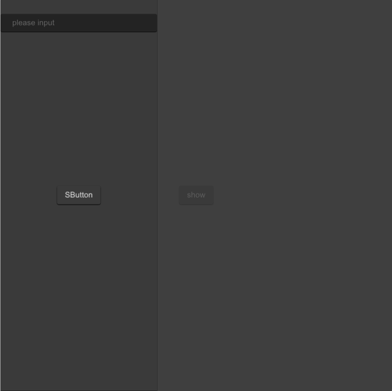

# SDrawer
Sometimes, the Dialogue component does not meet our needs
such as your form being too long, or if you need to temporarily display some documents, please use the SDrawer


## example
```rust
import {SDrawer,SButton, SInput} from "../../index.slint";
import {Themes} from "../../use/index.slint";

component TestDrawer inherits Window {
  height: 800px;
  width: 800px;
  background: #535353;
 
  SButton {
    text: "show";
    clicked => {
      p.open();
      
      debug("sds1")
    }
  }
 

  p:=SDrawer {
    proportion:40%;
    drawer-theme: Dark;
    SButton {
      theme: Dark;
    }
    SInput { 
      y: 30px;
     }
  }
}
```
## properties
- in property <Themes> drawer-theme : drawer theme 
- in property <brush> drawer-background-color : drawer background color
- in property <PaddingType> padding-type: drawer padding type
- in property <Position> position : the position of the drawer
- in property <percent> proportion : the percentage of the drawer
## functions
- function default-height-width()->{height:percent,width:percent} : count drawer height and width ⛔
- function get-position()->{x:length,y:length} : count position ⛔
