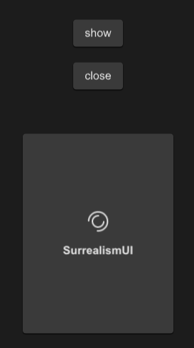

# SLoading
This is a loading component that you can embed anywhere you want to add a loading animation



## example
```rust
import {SLoading,SButton,SCard} from "../../index.slint";

export component TestLoading inherits Window {
    height: 600px;
    width: 400px;
    SButton {
      y: 100px;
      text: "show";
      clicked => {
        p.open();
      }
    }
    SButton {
      y: 160px;
      text: "close";
      clicked => {
        p.close();
      }
    }
    SCard{
      y: 260px;
      clip: true;
      card-height: 260px;
      card-width: 180px;
      p:=SLoading {
        text : "SurrealismUI";
        font-weight:700;
      }
    }
}
```

## properties inherits Window
- in property <int> font-weight : loading text font weight
- in property <length> font-size: loading text font size
- in property <brush> font-color : loading text font color
- in property <bool> font-italic : loading text font italic
- in property <string> font-family : loading text font family
- in property <image> loading-icon : loading icon
- in-out property <duration> duration : loading animation duration
- in property <string> text : loading text 
- in-out property <bool> is-show : loading is show or not
- in property <Themes> theme : SurrealismUI theme
- in property <easing> easing : loading animation easing type
- in-out property <int> iteration-count : loading animation iteration count
## functions
## callbacks
- callback open() : open the loading
- callback close() : close the loading
