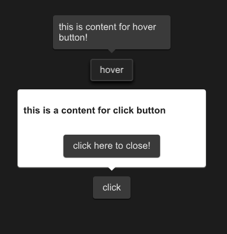

# SPopover
A customizable popover component designed to display contextual information or interactive content, attached to an element and floating above the UI. It supports various positions and can be shown or hidden programmatically.



## example
```rust
import {SPopover,SButton,SText } from "../../index.slint";
import {Themes} from "../../use/index.slint";
component TestPopover {
  height: 400px;
  width: 400px;
  hover-btn:=SButton { 
    y: 100px;
    text: "hover";
  }
  SPopover{
    y: hover-btn.y;
    x: hover-btn.x;
    owner-width:hover-btn.width;
    owner-height:hover-btn.height;
     height:inner.height;
     width: inner.width;
     theme: Themes.Dark;
     position: Right;
     is-show:hover-btn.has-hover;
     inner:= Rectangle{
      height: 46px;
      width: 180px;
      VerticalLayout {
        SText {
          text: "this is content for hover button!";
        }
      }
    }
  }
  click-btn:=SButton { 
    y: 300px;
    text: "click";
    clicked => {
      click-pop.clicked();
    }
  }
  click-pop:= SPopover{
    y: click-btn.y;
    x: click-btn.x;
    owner-width: click-btn.width;
    owner-height: click-btn.height;
     height:inner2.height;
     width: inner2.width;
     theme: Themes.Light;
     position: Top;
     inner2:= Rectangle{
      height: 120px;
      width: 300px;
      VerticalLayout {
        alignment: space-around;
        SText {
          font-weight: 700;
          theme: Light;
          text: "this is a content for click button";
        }
        Rectangle {
          SButton {
            text:"click here to close!";
            clicked => {
              click-pop.close();
            }
          }
        }
      }
    }
  }
}
```
## Properties
- in-out property <Themes> theme : The theme of the popover, allowing customization of its appearance according to the provided theme settings.
- in-out property <Position> position : The position of the popover relative to its owner element, determining where the popover is displayed around the owner.
- in-out property <bool> is-show : A boolean value indicating whether the popover is currently shown or hidden.
- in-out property <length> owner-height : The height of the owner element to which the popover is attached, used in positioning calculations.
- in-out property <length> owner-width : The width of the owner element to which the popover is attached, used in positioning calculations.
## Functions
- public function open() : Shows the popover by setting the is-show property to true.
- public function close() : Hides the popover by setting the is-show property to false.
- pure public function count-x(w:length) -> length : Calculates the X-coordinate for the popover's position based on the specified width and the position relative to the owner.
- pure public function count-y(h:length) -> length : Calculates the Y-coordinate for the popover's position based on the specified height and the position relative to the owner.
## Callbacks
- callback clicked: Triggered when the popover is clicked. Toggles the visibility of the popover by changing the is-show property.

