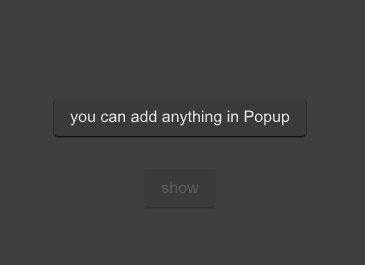

# SPopup
A masked popup layer appears in the current window
And users will not be able to use the popup layer to cover the components under it. 
Clicking on the popup layer again will close it



## example
```
import {SPopup,SButton} from "../../index.slint";
import {Themes} from "../../use/index.slint";

component TestPopup inherits Window {
  height: 500px;
  width: 500px;
  background: #535353;
 
  SButton {
    text: "show";
    clicked => {
      p.open();
      debug("sds1")
    }
  }
  p:=SPopup {
    SButton {
      text: "you can add anything in Popup";
      y: 160px;
    }
  }
}
```
## properties  inherits Window
- in-out property <bool> is-show : popup is show or not
- in property <Themes> theme : SurrealismUI theme
- in property <percent> mask-opacity : popup mask opacity
## functions
- public function open() : open the popup
- public function close() : close the popup
## callbacks
