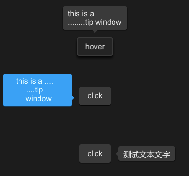

# STip
A tip provides supplemental, contextual information elevated near its target component


## example
```rust
import {STip,SButton } from "../../index.slint";
import {Themes} from "../../use/index.slint";


component TestWindow inherits Window {
  height: 400px;
  width: 400px;
  STip{
    y: 80px;
     height:inner0.height;
     width: inner0.width;
     theme: Dark;
     position:Top;
     text:"this is a \n........tip window";
     is-show:inner0.has-hover;
     inner0:=SButton { 
       text: "hover";
     }
   }
  STip{
    
    height:inner.height;
    width: inner.width;
    theme: Primary;
    position:LeftBottom;
    overflow: TextOverflow.elide;
    tip-width : 120px;
    horizontal-alignment: center;
    text:"this is a ....\n....tip\n window";
    inner:=SButton { 
      text: "click";
      clicked => {
        parent.clicked();
      }
    }
  }
  STip{
   y: 300px;
    height:inner2.height;
    width: inner2.width;
    theme: Dark;
    position:Right;
    // wrap: TextWrap.no-wrap;
    text:"测试文本文字";
    font-size: 16px;
    inner2:=SButton { 
      text: "click";
      clicked => {
        parent.clicked();
      }
    }
  }
 
}
```
## properties
- in-out property <string> font-family : tip text font family
- in-out property <int> font-weight :  tip text font weight
- in-out property <length> font-size:  tip text font size
- in-out property <brush> font-color :  tip text font color
- in-out property <bool> font-italic :  tip text font italic
- in-out property <Themes> theme :  tip theme
- in-out property <TextWrap> wrap :  tip text wrap
- in-out property <TextOverflow> overflow :  tip text overflow
- in-out property <length> letter-spacing :  tip text letter spacing
- in-out property <TextHorizontalAlignment> horizontal-alignment :  tip text horizontal alignment
- in-out property <TextVerticalAlignment> vertical-alignment : tip text vertical alignment
- in-out property <Position> position : the position of tip
- in-out property <bool> is-show : tip is show or not
- in-out property <string> text : tip text
- in property <length> tip-width : tip width
## functions
- public function open() : open the tip
- public function close() : close the tip
- pure public function count-x(w:length) ->length : count x for angle
- pure public function count-y(w:length) ->length : count y for angle
## callbacks
- callback clicked() : use to open|close the tip
