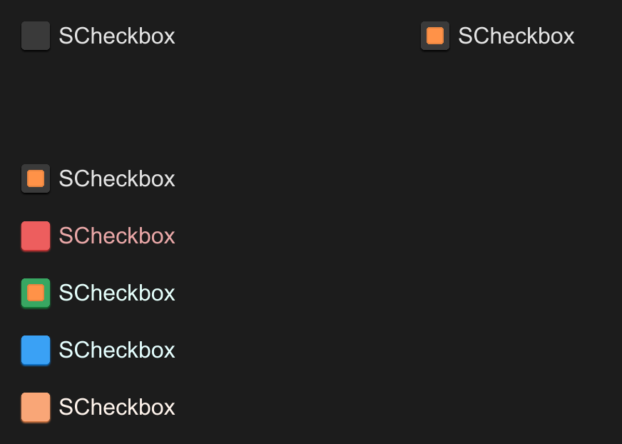

# SCheckbox
SCheckbox let people select multi items



## example

```rust
import { SCheckbox } from "../../index.slint";
component TestCheckbox {
    height: 400px;
    width: 600px;
    VerticalLayout {
        spacing: 20px;
        padding: 20px;
        HorizontalLayout {
            height: 80px;
            SCheckbox {
                height: 40px;
            }
            SCheckbox {}
        }
        SCheckbox {
            actived: true;
            clicked(text, value, actived) => {
                debug(text,value,actived)
            }
        }

        SCheckbox {
            disabled: true;
            theme: Error;
            clicked(text, value, actived) => {
                debug(text,value,actived)
            }
            pending => {
                debug("pending")
            }
        }

        SCheckbox {
            theme: Success;
        }

        SCheckbox {
            theme: Primary;
        }

        SCheckbox {
            theme: Warning;
        }
    }
}

```

## properties inherits Rectangle
- `in property <int> font-weight` : display text font weight
- `in property <length> font-size` : display text font size
- `in property <brush> font-color` : display text font color
- `in property <bool> font-italic` : display text font italic
- `in property <string> font-family` : display text font family
- `in property <Themes> theme` : SurrealismUI theme
- `in property <length> card-height` : radio height (contain padding)
- `in property <length> card-width` : radio width (contain padding)
- `in property <string> text` : display text
- `in-out property <string> value` : radio value
- `in-out property <bool> actived` : is actived or not
- `in-out property <brush> active-color` : active radio color
- `in property <PaddingType> padding-type` : radio padding type
- `in property <ShadowType> shadow-type` : radio shadow type
- `in property <BorderType> border-type` : radio border type

## functions

## callbacks
- `callback clicked(string,string,bool)` : run if you click the radio