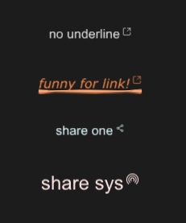

# SLink

SLink is commonly used to represent text connections or sharing


## example
```rust
import {SLink} from "../../index.slint";
import {Themes,UseIcons} from "../../use/index.slint";

component TestWindow inherits Window {
  height: 420px;
  width: 400px;
  
  SLink {
    y: 100px;
    theme: Dark;
    text: "no underline";
    underline: false;
  }
  SLink {
    y: 160px;
    funny:true;
    theme: Warning;
    text: "funny for link!";
    font-italic : true;
    font-weight: 200;
    font-family : "Verdana";
  }
  SLink {
    y: 220px;
    theme: Primary;
   
    icon: @image-url("../../icons/share-one.svg");
    text: "share one";
  }
  SLink {
    y: 280px;
    funny:true;
    theme: Error;
    icon : @image-url("../../icons/share-sys.svg");
    font-size: 24px;
    text: "share sys";
    clicked(link-text)=>{
      debug("share sys!")
    }
  }
}
```
## properties
- in property <image> icon : link share icon
- in property <bool> funny : use funny underline
- in property <bool> underline : has underline or not
- out property <bool> has-hover : link has hover or not 
- in property <MouseCursor> mouse-cursor : link mouse cursor
- in property <Themes> theme : SurrealismUI theme
- in property <length> font-size : link font size
- in-out property <string> text : link text
- in property <int> font-weight : link font weight
- in property <bool> font-italic : link font italic
- in property <string> font-family : link font family
- private property <brush> text-color : link text color
## callbacks
- callback clicked(string) : run if you click share icon
