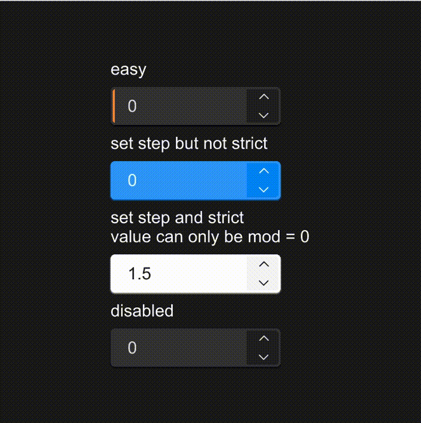

# SNumberInput
A numeric input component that inherits from SCard, designed for inputting numerical values within a specified range. It allows adjustments through increment and decrement actions.



## example

```rust
import { SNumberInput } from "../../index.slint";

component TestNumberInput {
    height: 400px;
    width: 400px;
    HorizontalLayout {
        alignment: center;
        VerticalLayout {
            spacing: 8px;
            alignment: center;
            Text {text:"easy";font-size: 16px;}
            SNumberInput {}
            Text {text:"set step but not strict";font-size: 16px;}
            SNumberInput {
                theme: Primary;
                step: 0.5;
            }
            Text {text:"set step and strict\nvalue can only be mod = 0";font-size: 16px;}
            SNumberInput {
                value: 1.5;
                theme: Light;
                strict: true;
                step: 0.5;
                unexpect(num) => {
                    debug("unexpected number:" + num);
                }
            }
            Text {text:"disabled";font-size: 16px;}
            SNumberInput {
                disabled: true;
            }
        }
    }
}
```

## Properties
- `in-out property <float> minimum`: The minimum value that the input can hold, default set to 0.
- `in-out property <float> maximum`: The maximum value that the input can hold, default set to 100.
- `in-out property <float> value`: The current numerical value of the input, initialized at 0.
- `in-out property <bool> disabled`: A boolean indicating whether the input is disabled (non-interactive), default set to false.
- `in property <float> step`: The step increment or decrement applied when adjusting the value, set to 1.0.
- `in property <bool> strict`: A boolean to enforce strict bounds. If true, inputs outside of the min-max range are not accepted.
- `in-out property <InputType> input-type`: Defines the type of numerical input allowed (e.g., integer, decimal), set to `InputType.decimal`.

## Functions
- `public function up()`: Increases the input's value by the step size unless it exceeds the maximum limit or the input is disabled.
- `public function down()`: Decreases the input's value by the step size unless it is less than the minimum limit or the input is disabled.

## Callbacks
- `callback accepted(float)`: Triggered when a new value is input and accepted within the valid range.
- `callback changed(float)`: Triggered every time the value is changed through user interaction.
- `callback unexpect(float)`: Triggered when an input is provided that does not conform to the specified restrictions (if `strict` is true).