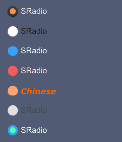

# SRadio

SRadio let people select a single item


## example
```rust
import {SRadio} from "../../index.slint";
import {Themes} from "../../use/index.slint";
import { SText } from "../../src/text/index.slint";

component TestCollection inherits Window {
  height: 560px;
  width: 600px;
  background: #515c74;
  VerticalLayout {
    spacing: 20px;
    padding: 20px;
    SRadio{
      actived: true;
    }
    SRadio{theme: Light;}
    SRadio{theme: Primary;}
    SRadio {theme: Error;}
    SRadio {
      theme: Warning;
      font-weight: 700;
      text : "Chinese";
      font-color: #ff5e00;
      font-italic: true;
      font-family: "Verdana";
    }
    SRadio {
      theme: Info;
      clicked(text,value,actived) => {
        debug(text);
        debug(value);
        debug(actived);
      }
    }
    SRadio{
      active-color : #4affae;
      theme:Primary;
      actived : true;
    }
  }
}
```
## properties inherits Rectangle
- in property <int> font-weight : display text font weight
- in property <length> font-size: display text font size
- in property <brush> font-color : display text font color
- in property <bool> font-italic : display text font italic
- in property <string> font-family : display text font family
- in property <Themes> theme : SurrealismUI theme
- in property <length> card-height: radio height (contain padding)
- in property <length> card-width: radio width (contain padding)
- in property <string> text : display text
- in-out property <string> value : radio value
- in-out property <bool> actived : is actived or not
- in-out property <brush> active-color: active radio color
- in property <PaddingType> padding-type : radio padding type
- in property <ShadowType> shadow-type : radio shadow type
- in property <BorderType> border-type : radio border type
## functions
## callbacks
- callback clicked(string,string,bool) : run if you click the radio
