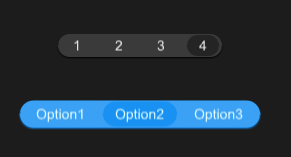

# SSwitchGroup
SSwitchGroup switch group can contain more switch cases



## example
```rust
import { SSwitchGroup } from "../../index.slint";
import { PaddingType } from "../../use/index.slint";
component TestSwitchGroup inherits Window {
  height: 400px;
  width: 400px;
  SSwitchGroup {
  active: "2";
   theme: Primary;
   width: 240px;
   switchs:[
    {label:"Option1",value:"0"},
    {label:"Option2",value:"2"},
    {label:"Option3",value:"3"},
  ];
    clicked(i,name) => {
      debug(i);
      debug(name);
    }
  }
  SSwitchGroup {
    active: "1";
    y: 120px;
    theme:Dark;
    padding-type: PaddingType.Small;
    switchs:[
      {label:"1",value:"0"},
      {label:"2",value:"2"},
      {label:"3",value:"3"},
      {label:"4",value:"1"},
    ];
     clicked(i,name) => {
       debug(i);
       debug(name);
     }
   }
}
```
## properties inherits SCard
- in-out property <string> active : active option value
- in-out property <[SOption]> switchs : switch options
- in property <length> font-size : font size , it will effect switch component height
- private property <brush> theme-color : inner theme color
## callbacks
- callback clicked(int,SOption) : run if you click the switch , it will back option index and option name
