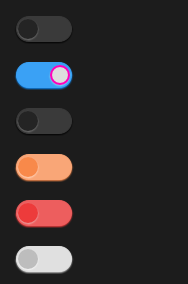

# SSwitch

SSwitch is a switch used for simple judgment scenarios



## example
```rust
import { SSwitch , SCard} from "../../index.slint";

component TestSwitch inherits Window {
  height: 400px;
  width: 400px;
  
  
    VerticalLayout {
      spacing: 20px;
      padding: 20px;
      SSwitch {
      }
      SSwitch {
        active: true;
        theme: Primary;
        switch-background-color:#ddd;
        switch-border-color:#ff00bb;
      }
      SSwitch {
        theme: Dark;
        active: false;
        clicked(active-or-not)=>{
          debug(active-or-not);
        }
      }
      SSwitch {
        theme: Warning;
      }
      SSwitch {
        theme: Error;
      }
      SSwitch {
        theme: Info;
      }
    }
}
```

## properties
- in-out property <bool> active : is actived or not
- in property <brush> switch-background-color : switch background color
- in property <brush> switch-border-color : switch border color
- in property <color> switch-drop-shadow-color switch drop shadow color
- in property <length> switch-height : switch height
- in property <length> switch-width : switch width
- in property <PaddingType> switch-padding-type: switch padding type
- in property <ShadowType> switch-shadow-type: switch shadow type
- in property <BorderType> switch-border-type : switch border type
## callbacks
- callback clicked(bool) : run if you click the switch
