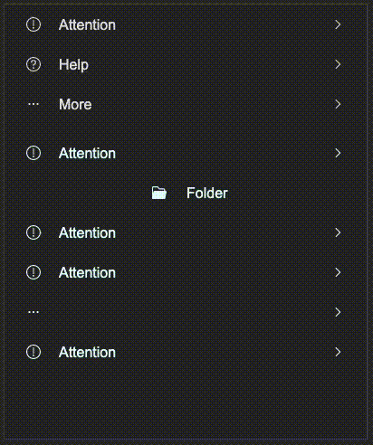

# SCatalog

The Catalog component is used to display a series of catalog items, each of which can contain labels and icons, and has click interaction functionality.



## example

```rust
import {SCatalog} from "../../index.slint";
import { CatalogItem, UseIcons } from "../../use/index.slint";
component TestCatalog inherits Window{
    height: 480px;
    width: 400px;
    in property <CatalogItem> base: {
        left-icon: UseIcons.icons.Attention,
        show-left-icon: true,
        label: "Attention",
        show-label: true,
        value: "8uyf23rfgd",
        right-icon: UseIcons.icons.Right,
        show-right-icon: true,
        align: LayoutAlignment.space-between,
    };

    VerticalLayout {
        spacing: 10px;
        SCatalog {
            height: self.real-height;
            items: [
                {
                    left-icon: UseIcons.icons.Attention,
                    show-left-icon: true,
                    label: "Attention",
                    show-label: true,
                    value: "8uyf23rfgd",
                    right-icon: UseIcons.icons.Right,
                    show-right-icon: true,
                    align: LayoutAlignment.space-between,
                },
                {
                    left-icon: UseIcons.icons.Help,
                    show-left-icon: true,
                    label: "Help",
                    show-label: true,
                    value: "8uyf23rfgd1",
                    right-icon: UseIcons.icons.Right,
                    show-right-icon: true,
                    align: LayoutAlignment.space-between,
                },
                {
                    left-icon: UseIcons.icons.More,
                    show-left-icon: true,
                    label: "More",
                    show-label: true,
                    value: "8uyf23rfgd2",
                    right-icon: UseIcons.icons.Right,
                    show-right-icon: true,
                    align: LayoutAlignment.space-between,
                }
            ];
        }
        SCatalog {
            theme: Primary;
            height: self.real-height;
            items: [
                base,
                {
                    left-icon: UseIcons.icons.Folder-filled,
                    show-left-icon: true,
                    label: "Folder",
                    show-label: true,
                    value: "8uyf23rfgd2",
                    right-icon: UseIcons.icons.Right,
                    show-right-icon: false,
                    align: LayoutAlignment.center,
                },
                base,
                base,
                {
                    left-icon: UseIcons.icons.More,
                    show-left-icon: true,
                    label: "More",
                    show-label: false,
                    value: "8uyf23rfgd2",
                    right-icon: UseIcons.icons.Right,
                    show-right-icon: true,
                    align: LayoutAlignment.space-between,
                },
                base,
            ];
            clicked(index, item) => {
                debug(index);
                debug(item.value);
            }
        }
    }
}
```

## properties
- `in property <PaddingType> padding-type` :  catalog padding type
- `in property <Themes> theme` :  SurrealismUI theme
- `in property <[CatalogItem]> items` :  catalog items see `CatalogItem`
- `in property <length> font-size` :  catalog label font size, which affect the height of the catalog item
- `in property <int> font-wight` :  catalog label font weight
- `in property <string> font-family` :  catalog label font family
- `in property <bool> font-italic` : catalog label font italic
- `in property <length> spacing` :  spacing between left icon and label
- `in property <brush> active-color` :  catalog item active color
- `out property <length> real-height` :  real height of the catalog, you can use it to set the height of the catalog (recommend)
- `in-out property <length> item-height` :  height of the catalog item
## functions
- `pure function has-active(hover: bool, pressed: bool) -> bool` : judge whether the catalog item is active
## callbacks
- `callback clicked(int, CatalogItem)`: click event callback, return the index of the clicked item and the item object