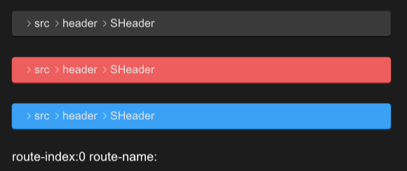

# SHeader
SHeader is a simple header component that is generated based on routing information



## example
```rust
import {SHeader} from "../../index.slint";
import {Themes} from "../../use/index.slint";

component TestHeader inherits Window {
  width: 600px;
  height: 400px;
  VerticalLayout {
    padding: 30px;
    spacing: 30px;
    SHeader {
      theme: Dark;
    }
    SHeader {
      theme: Error;
    }
    SHeader {
      theme: Primary;
      font-size: 16px;
      clicked(index,node)=>{
        txt.index = index;
        txt.name = node.label;
      }
    }
    txt:=Text{
      font-size: 18px;
      in-out property <int> index;
      in-out property <string> name;
      text: "route-index:" + index + " route-name:" + name;
    }
  }
}
```
## properties inherits SCard
- in property <length> spacing : the spacing of header
- in property <[SOption]> value : route value of header
- in property <image> source : split icon of header
## functions
## callbacks
- callback clicked(int,SOption) : run if you click the header
