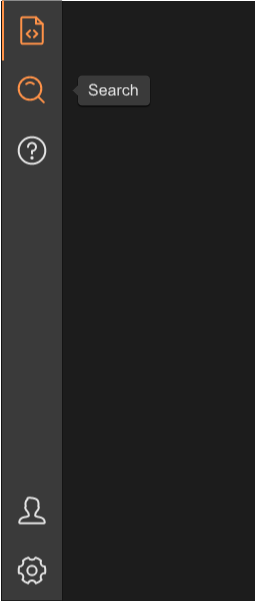

# SMenu
SMenu is a menu bar located on the left side that you can quickly generate through the menu-data property



## example
```rust
import { SMenu , SIcon} from "../../index.slint";
import {UseIcons} from "../../use/index.slint";

component TestMenu inherits Window {
    height: 600px;
    width: 300px;
    Rectangle {
      x: 0;
      y: 0;
      height:parent.height;
      width: menu.width;
      menu:=SMenu {
        theme: Dark;
        change(index,item)=>{
          debug(index);
          debug(item);
        }
        clicked-account()=>{
          debug("clicked account");
        }
      }
    }
}
```
## properties
- in-out property <length> icon-box-size : menu item size ⛔
- in-out property <length> icon-size : menu item icon size ⛔;
- in property <[MenuData]> menu-data : menu item data (generate menus through it)
- in-out property <int> active : which item is active
- private property <brush> hover-icon-color : menu item icon color changed when hover
## callbacks
- callback change(int,MenuData) : run if you click menu item
- callback clicked-account() : run if you click account icon
- callback clicked-setting() : run if you click setting icon
