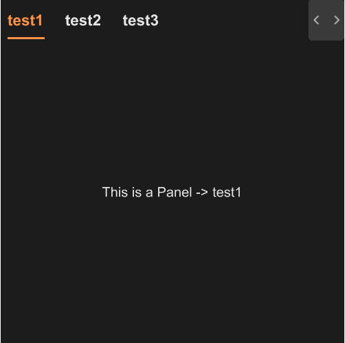

# STab

provide tab functionality, so that users can switch between different content sections



## example
```rust
import { STab , STabPanel} from "../../index.slint";
import { SText } from "../../src/text/index.slint";
export component TestTab {
    height: 400px;
    width: 400px;
    function show-panel(index:string) {
        panel1.visible = false;
        panel2.visible = false;
        if(index==panel1.index){
            panel1.visible = true;
        }else if(index==panel2.index){
            panel2.visible = true;
        }else{
            panel1.visible = true;
        }
    }
    STab {
        tabs:[
            {label:"test1",value:"0"},
            {label:"test2",value:"1"},
            {label:"test3",value:"2"}
          ];
        changed(kv) => {
            show-panel(kv.value);
        }
        mounted(index) => {
            show-panel(index);
        }
        panel1:=STabPanel {
            index: "0";
            SText {
                text: "This is a Panel -> test1";
            }
        }
        panel2:=STabPanel {
            index: "1";
            SText {
                text: "This is a Panel -> test2";
            }
        }
    }
}
```
## properties inherits SCard
- in property <Themes> theme : Surrealism Themes
- in property <length> font-size : header font size
- in property <int> font-weight : header font weight
- in property <[SOption]> tabs : tab datas
- in-out property <string> active : active item
## functions
- function to-left() : let tab header to pre page 
- function to-right() : let tab header to next page
## callbacks
- callback change(SOption) : run after you change the tab
- callback mounted(string) : run when init callback happend
