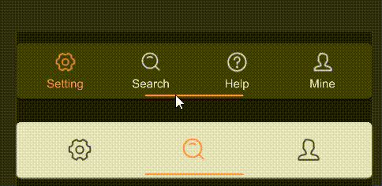

# STabbar
provide bottom operation bar for page switching



## example

```rust
import { STabbar } from "../../index.slint";
import { UseIcons } from "../../use/index.slint";
component TestTabbar {
    height: 160px;
    width: 360px;
    VerticalLayout {
        alignment: space-around;
        // have label name
        STabbar {
            theme: Dark;
            tabs: [
                {
                    id: 0,
                    name: "Setting",
                    icon: UseIcons.icons.Setting-two
                },
                {
                    id: 1,
                    name: "Search",
                    icon: UseIcons.icons.Search
                },
                {
                    id: 2,
                    name: "Help",
                    icon: UseIcons.icons.Help
                },
                {
                    id: 3,
                    name: "Mine",
                    icon: UseIcons.icons.Avatar
                }
            ];
        }
        // no label name
        STabbar {
            theme: Info;
            show-text: false;
            icon-scale: 1.4;
            active: 1;
            tabs: [
                {
                    id: 0,
                    name: "Setting",
                    icon: UseIcons.icons.Setting-two
                },
                {
                    id: 1,
                    name: "Search",
                    icon: UseIcons.icons.Search
                },
                {
                    id: 2,
                    name: "Mine",
                    icon: UseIcons.icons.Avatar
                }
            ];
        }
    }
}
```

## properties
- `in-out property <[MenuData]> tabs` :  the array of menu data for the tabs.
- `in property <float> icon-scale` :  the scale factor for the icons.
- `in property <length> tab-size` :  the size of each tab.
- `in-out property <int> active` :  the index of the currently active tab.
- `in property <bool> show-text` :  whether text should be displayed alongside icons.
## functions
## callbacks
- `callback change(MenuData)`:  This callback is triggered when the active tab is changed.