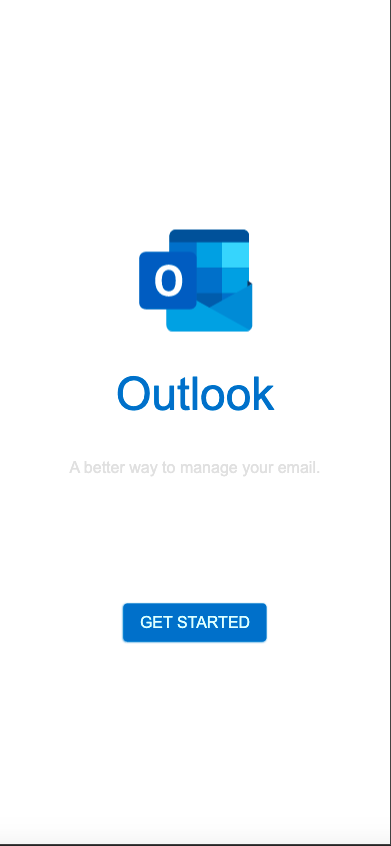

# Step2: Signin

In Signin page, it includes two main part
- logo and word 
- button area

## Page Part

- logo and word
  - Outlook logo: `SIcon`
  - Outlook title: `SText`
  - Outlook short sentence: `SText`
- signin btn: `SButton`


## Source Code
```rust
import { SIcon, SText, SButton } from "../modules/surrealism-ui/index.slint";
import { ROOT-GLOBAL } from "../global.slint";


export component Signin inherits Rectangle{
    height: 100%;
    width: 100%;
    background: #fff;
    VerticalLayout {
        height: 52%;
        alignment: LayoutAlignment.space-between;
        VerticalLayout {
            Rectangle {
                SIcon {
                    height: 156px;
                    width: 156px;
                    source: ROOT-GLOBAL.icons.logo;
                }
            }
            Rectangle {
                height: 72px;
                SText {
                    horizontal-alignment: TextHorizontalAlignment.center;
                    width: 100%;
                    text: "Outlook";
                    color: ROOT-GLOBAL.theme-color;
                    font-size: 46px;
                    font-weight: 100;
                }
            }
            Rectangle {
                height: 72px;
                SText {
                    horizontal-alignment: TextHorizontalAlignment.center;
                    width: 100%;
                    text: "A better way to manage your email.";
        
                }
            }
        }
        Rectangle {
            height: singin-btn.height;
            singin-btn:= SButton{
                theme: Primary;
                text: "GET STARTED";
            }
        }   
    }
}
```