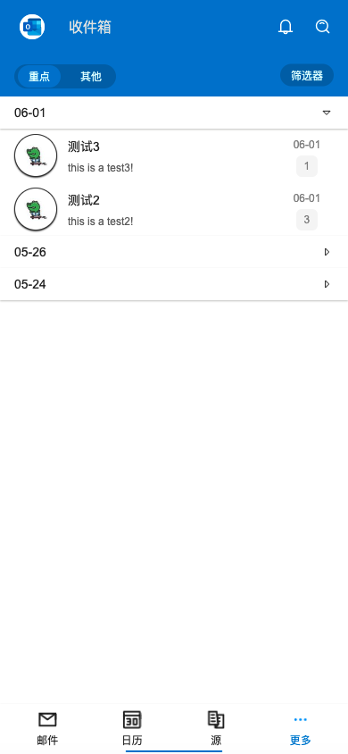

# Step3: MainView



## Source Code

```rust
import { Header, ContentItem } from "../components/index.slint";
import { SButton, STabbar, SDrawer, SIcon, SCard, SText,SMenu, SSwitchGroup, SPopover, SCatalog, SRadio, SCollapse, SCollapseItem } from "../modules/surrealism-ui/index.slint";
import { ROOT-GLOBAL, Content } from "../global.slint";
import { ScrollView } from "std-widgets.slint";
import { UseIcons } from "../modules/surrealism-ui/use/index.slint";

component PopoverList {
  in property <[{icon: image, text: string, id: int}]> items;
  callback clicked(string);
    VerticalLayout {
      for item[index] in root.items: HorizontalLayout {
        alignment: space-between;
        height: 32px;
        Rectangle {
          SIcon{
            source: item.icon;
          }
        }
        SText {
          theme: Light;
          width: 50%;
          horizontal-alignment: left;
          text: item.text;
          font-size: 14px;
        }
        VerticalLayout {
          alignment: center;
          SRadio{
            active-color: ROOT-GLOBAL.theme-color;
            theme: Light;
            text: "";
            clicked => {
               root.clicked(item.text)
            }
          }
        }
      }
    }
}


export component MainView {
  in property <[string]> infos: [
    "所有账户",
    @tr("{}\n{}","Outlook","syf20020816@outlook.com"),
    @tr("{}\n{}","Gmail","surrealism.sheng@gmail.com"),
  ];
  in property <[Content]> contents: [
    {
      time: "06-01",
      datas: [
        {
          source: @image-url("../assets/avatar/avatar2.png"),
          title: "测试3",
          summary: "this is a test3!",
          count: 1
        },
        {
          source: @image-url("../assets/avatar/avatar2.png"),
          title: "测试2",
          summary: "this is a test2!",
          count: 3
        }
      ]
    },
    {
      time: "05-26",
      datas: [
        {
          source: @image-url("../assets/avatar/avatar2.png"),
          title: "测试2",
          summary: "this is a test2!",
          count: 3
        },
        {
          source: @image-url("../assets/avatar/avatar1.png"),
          title: "测试1",
          summary: "this is a test!",
          count: 2
        },
        {
          source: @image-url("../assets/avatar/avatar1.png"),
          title: "测试1",
          summary: "this is a test!",
          count: 2
        },
        {
          source: @image-url("../assets/avatar/avatar1.png"),
          title: "测试1",
          summary: "this is a test!",
          count: 2
        }
      ]
    },
    {
      time: "05-24",
      datas: [
        {
          source: @image-url("../assets/avatar/avatar1.png"),
          title: "测试1",
          summary: "this is a test!",
          count: 2
        }
      ]
    },
  ];
  height: 100%;
  width: 100%;
  main-layout:= VerticalLayout {
    header := Header {
      clicked-logo => {
        side-drawer.open();
      }
    }
    main-content:= Rectangle{
      background: #fff;
      height: main-layout.height - header.height - tabbar.height;
      clip: true;
      VerticalLayout {        
        main-header:= Rectangle {
          z: 111;
          background: ROOT-GLOBAL.theme-color;
          height: 48px;
          HorizontalLayout {
            padding-left: 16px;
            padding-right: 16px;
            padding-top: 12px;
            padding-bottom: 12px;
            alignment: LayoutAlignment.space-between;
            SSwitchGroup {
              active: "option-key";
              background: #0165b2;
              card-width: 82px;
              theme: Primary;
              font-size: 12px;
              switchs: [
                {label: "重点",value: "option-key"},
                {label: "其他",value: "option-other"}
              ];
            }
            Rectangle {
              cheat-txt:= Text {
                visible: false;
                text: "筛选器";
              }
              popover-btn:= SSwitchGroup {
                
                active: "filter";
                card-width: cheat-txt.width;
                theme: Primary;
                font-size: 12px;
                switchs: [
                  {label: "筛选器",value: "filter"},               
                ];
                private property <bool> opened <=> popover-wraper.is-show;
                clicked(index, option) => {
                  if option.value == "filter"{
                    if !opened{
                      popover-wraper.open();
                    }else{
                      popover-wraper.close();
                    }
                  }
                }
              }
              popover-wraper:=SPopover{
                
                y: popover-btn.y;
                x: popover-btn.x;
                owner-width:popover-btn.width;
                owner-height:popover-btn.height;
                height: inner.height;
                width: inner.width;
                theme: Light;
                position: LeftTop;
                inner:= Rectangle{
                  height: p-list.height;
                  width: 160px;
                  p-list := PopoverList{
                    width: 100%;
                    items: [
                      {icon: ROOT-GLOBAL.icons.popover.email, text:"所有邮件", id: 0},
                      {icon: ROOT-GLOBAL.icons.popover.unread, text:"未读", id: 1},
                      {icon: ROOT-GLOBAL.icons.popover.flag, text:"已标记", id: 2},
                      {icon: ROOT-GLOBAL.icons.popover.pin, text:"已固定", id: 3},
                      {icon: ROOT-GLOBAL.icons.popover.person, text:"收件人是我", id: 4},
                      {icon: ROOT-GLOBAL.icons.popover.link, text:"带有附件", id: 5},
                      {icon: ROOT-GLOBAL.icons.popover.at, text:"提及我", id: 6},
                    ];
                    clicked(clicked-text) => {
                      cheat-txt.text = clicked-text;
                      popover-btn.switchs[0].label = clicked-text;
                    }
                  }
                }
              }
            }
          }
        }
        content-wrapper:= Rectangle {
          z: 100;
          clip: true;
          width: parent.width;
          height: parent.height - main-header.height;
          SCollapse {
            width: parent.width;
            for content[index] in root.contents:  SCollapseItem {
              theme: Light;
              header-title: content.time;
              width: parent.width - self.padding-left - self.padding-right;
              font-size: 14px;
              is-show: true;
              details-height: content.datas.length * 60px + 36px;
              init => {
                debug(self.details-height);
              }
              // todo!(remove right icon)
              VerticalLayout {
                z: 11;
                padding-right: 16px;
                padding-left: 16px;
                for data[d-index] in content.datas: ContentItem{
                  z: 11;
                  data: data;
                  width: parent.width - 32px;
                  time: content.time;
                }
              }
            }
          }
        }
      }


      tabbar-drawer:= SDrawer {
        position: Bottom;
        proportion: 14%;
        drawer-layout:= VerticalLayout {
          padding-top: 8px;
          padding-left: 16px;
          padding-right: 16px;
          alignment: LayoutAlignment.space-between;
          SText{
            height: 16px;
            text: "重新排序";
            font-size: 12px;
            width: 100%;
            horizontal-alignment: TextHorizontalAlignment.right;
            color: #aaa;
          }
          Rectangle {
            height: drawer-layout.height - 16px;
            HorizontalLayout {
              spacing: 32px;
              height: icon-file-wrapper.height;
              icon-file-wrapper:= SCard {
                theme: Light;
                card-height: icon-file.height;
                card-width: icon-file.width;
                padding-type: Small;
                icon-file:= SIcon {
                  height: 26px;
                  width: 26px;
                  source: ROOT-GLOBAL.icons.tabbar.file.unclicked;
                }
              }
              SCard{
                theme: Light;
                card-height: icon-connection.height;
                card-width: icon-connection.width;
                padding-type: Small;
                icon-connection:=SIcon {
                  height: 26px;
                  width: 26px;
                  source: ROOT-GLOBAL.icons.tabbar.connection.unclicked;
                }
              }
            }
          }
        }
      }
    }
    tabbar:= STabbar{
      active: 1;
      theme: Light;
      border-radius: 0;
      private property <bool> is-more <=> tabbar-drawer.is-show;
      tabs: [
        {
          id: "1",
          icon: ROOT-GLOBAL.icons.tabbar.email.unclicked,
          name: "邮件",
        },
        {
          id: "2",
          icon: ROOT-GLOBAL.icons.tabbar.calendar.unclicked,
          name: "日历",
        },
        {
          id: "3",
          icon: ROOT-GLOBAL.icons.tabbar.source.unclicked,
          name: "源",
        },
        {
          id: "4",
          icon: ROOT-GLOBAL.icons.tabbar.more.unclicked,
          name: "更多",
        }
      ];
      // todo!(callback clicked)
      change(item) => { 
        // if self.is-more{
        //   tabbar-drawer.close();
        // }
        if item.id == "4"{
          tabbar-drawer.open();
        }else{
          tabbar-drawer.close();
        }
      }
    } 
  }
  side-drawer:= SDrawer{
    proportion: 80%;
    HorizontalLayout {
      menu := SMenu{
        theme: Info;
        menu-data: [
          {
            icon: ROOT-GLOBAL.icons.menu.home,
            name: "所有账户",
            id: 0
          },
          {
            icon: @image-url("../assets/menu/outlook.svg"),
            name: "Outlook",
            id: 1
          },
          {
            icon: @image-url("../assets/menu/gmail.svg"),
            name: "Gmail",
            id: 2
          },
          {
            icon: ROOT-GLOBAL.icons.menu.add,
            name: "Add",
            id: 3
          },
        ];
        sub-menu-data: [
          {
            icon: ROOT-GLOBAL.icons.menu.help,
            name: "帮助",
            id: 3
          },
          {
            icon: UseIcons.icons.Setting-two,
            name: "帮助",
            id: 4
          },
        ];
        change(index,item) => {
          if index > root.infos.length - 1{
            return;
          }else{
            info.text = root.infos[index];
          }
        }
      }
      details := Rectangle{
        width:parent.width - 60px;
        VerticalLayout {
          spacing: 1px;
          info-box:= Rectangle {
            background: #fff;
            height: 60px;
            HorizontalLayout {
              padding-left: 8px;
              padding-right: 8px;
              info:= SText {
                width: parent.width;
                font-size: 14px;
                theme: Light;
                text: "所有账户";
              }
            }
            drop-shadow-blur: 1px;
            drop-shadow-color: #cccccc;
            drop-shadow-offset-y: 1px;
          }
          Rectangle {
            background: #fff;
            VerticalLayout {
              Rectangle {
                background: #fff;
                drop-shadow-blur: 1px;
                drop-shadow-color: #cccccc;
                drop-shadow-offset-y: 1px;
                SCatalog {
                  height: self.real-height;
                  theme: Info;
                  font-size: 14px;
                  items: [
                    {
                      label: "收藏夹",
                      show-label: true,
                      value: "edit",
                      right-icon: ROOT-GLOBAL.icons.menu.draft,
                      show-right-icon: true,
                      align: LayoutAlignment.space-between,
                    },
                    {
                      left-icon: ROOT-GLOBAL.icons.menu.inbox,
                      show-left-icon: true,
                      label: "收件箱",
                      show-label: true,
                      value: "inbox",
                      align: LayoutAlignment.space-between,
                    },
                    {
                      left-icon: ROOT-GLOBAL.icons.menu.send,
                      show-left-icon: true,
                      label: "已发送",
                      show-label: true,
                      value: "send",
                      align: LayoutAlignment.space-between,
                    },
                    {
                      left-icon: ROOT-GLOBAL.icons.menu.draft,
                      show-left-icon: true,
                      label: "草稿",
                      show-label: true,
                      value: "draft",
                      align: LayoutAlignment.space-between,
                    },
                  ];
                }
              }
              // MenuTools{}
            }
          }
        }
      } 
    }
  }
}

```