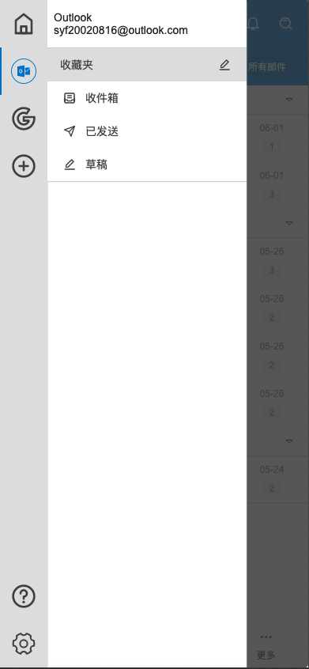

# Step3-5: SideDrawer



## Source Code

```rust
side-drawer:= SDrawer{
    proportion: 80%;
    HorizontalLayout {
      menu := SMenu{
        theme: Info;
        menu-data: [
          {
            icon: ROOT-GLOBAL.icons.menu.home,
            name: "所有账户",
            id: 0
          },
          {
            icon: @image-url("../assets/menu/outlook.svg"),
            name: "Outlook",
            id: 1
          },
          {
            icon: @image-url("../assets/menu/gmail.svg"),
            name: "Gmail",
            id: 2
          },
          {
            icon: ROOT-GLOBAL.icons.menu.add,
            name: "Add",
            id: 3
          },
        ];
        sub-menu-data: [
          {
            icon: ROOT-GLOBAL.icons.menu.help,
            name: "帮助",
            id: 3
          },
          {
            icon: UseIcons.icons.Setting-two,
            name: "帮助",
            id: 4
          },
        ];
        change(index,item) => {
          if index > root.infos.length - 1{
            return;
          }else{
            info.text = root.infos[index];
          }
        }
      }
      details := Rectangle{
        width:parent.width - 60px;
        VerticalLayout {
          spacing: 1px;
          info-box:= Rectangle {
            background: #fff;
            height: 60px;
            HorizontalLayout {
              padding-left: 8px;
              padding-right: 8px;
              info:= SText {
                width: parent.width;
                font-size: 14px;
                theme: Light;
                text: "所有账户";
              }
            }
            drop-shadow-blur: 1px;
            drop-shadow-color: #cccccc;
            drop-shadow-offset-y: 1px;
          }
          Rectangle {
            background: #fff;
            VerticalLayout {
              Rectangle {
                background: #fff;
                drop-shadow-blur: 1px;
                drop-shadow-color: #cccccc;
                drop-shadow-offset-y: 1px;
                SCatalog {
                  height: self.real-height;
                  theme: Info;
                  font-size: 14px;
                  items: [
                    {
                      label: "收藏夹",
                      show-label: true,
                      value: "edit",
                      right-icon: ROOT-GLOBAL.icons.menu.draft,
                      show-right-icon: true,
                      align: LayoutAlignment.space-between,
                    },
                    {
                      left-icon: ROOT-GLOBAL.icons.menu.inbox,
                      show-left-icon: true,
                      label: "收件箱",
                      show-label: true,
                      value: "inbox",
                      align: LayoutAlignment.space-between,
                    },
                    {
                      left-icon: ROOT-GLOBAL.icons.menu.send,
                      show-left-icon: true,
                      label: "已发送",
                      show-label: true,
                      value: "send",
                      align: LayoutAlignment.space-between,
                    },
                    {
                      left-icon: ROOT-GLOBAL.icons.menu.draft,
                      show-left-icon: true,
                      label: "草稿",
                      show-label: true,
                      value: "draft",
                      align: LayoutAlignment.space-between,
                    },
                  ];
                }
              }
              // MenuTools{}
            }
          }
        }
      } 
    }
}
```