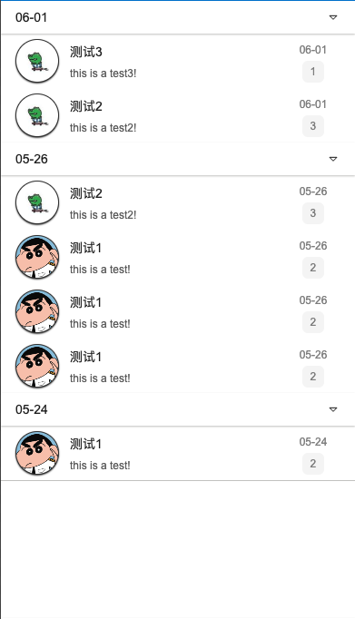

# Step3-4: Content



## Source Code

```rust
in property <[Content]> contents: [
    {
      time: "06-01",
      datas: [
        {
          source: @image-url("../assets/avatar/avatar2.png"),
          title: "测试3",
          summary: "this is a test3!",
          count: 1
        },
        {
          source: @image-url("../assets/avatar/avatar2.png"),
          title: "测试2",
          summary: "this is a test2!",
          count: 3
        }
      ]
    },
    {
      time: "05-26",
      datas: [
        {
          source: @image-url("../assets/avatar/avatar2.png"),
          title: "测试2",
          summary: "this is a test2!",
          count: 3
        },
        {
          source: @image-url("../assets/avatar/avatar1.png"),
          title: "测试1",
          summary: "this is a test!",
          count: 2
        },
        {
          source: @image-url("../assets/avatar/avatar1.png"),
          title: "测试1",
          summary: "this is a test!",
          count: 2
        },
        {
          source: @image-url("../assets/avatar/avatar1.png"),
          title: "测试1",
          summary: "this is a test!",
          count: 2
        }
      ]
    },
    {
      time: "05-24",
      datas: [
        {
          source: @image-url("../assets/avatar/avatar1.png"),
          title: "测试1",
          summary: "this is a test!",
          count: 2
        }
      ]
    },
];

content-wrapper:= Rectangle {
    z: 100;
    clip: true;
    width: parent.width;
    height: parent.height - main-header.height;
    SCollapse {
        width: parent.width;
        for content[index] in root.contents:  SCollapseItem {
            theme: Light;
            header-title: content.time;
            width: parent.width - self.padding-left - self.padding-right;
            font-size: 14px;
            is-show: true;
            details-height: content.datas.length * 60px + 36px;
            init => {
                debug(self.details-height);
            }
            // todo!(remove right icon)
            VerticalLayout {
                z: 11;
                padding-right: 16px;
                padding-left: 16px;
                for data[d-index] in content.datas: ContentItem{
                    z: 11;
                    data: data;
                    width: parent.width - 32px;
                    time: content.time;
                }
            }
        }
    }
}
```