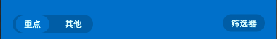
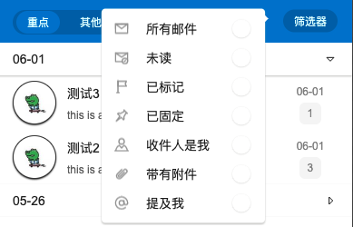

# Step3-3: Content Header





## Source Code

```rust
        HorizontalLayout {
            padding-left: 16px;
            padding-right: 16px;
            padding-top: 12px;
            padding-bottom: 12px;
            alignment: LayoutAlignment.space-between;
            SSwitchGroup {
              active: "option-key";
              background: #0165b2;
              card-width: 82px;
              theme: Primary;
              font-size: 12px;
              switchs: [
                {label: "重点",value: "option-key"},
                {label: "其他",value: "option-other"}
              ];
            }
            Rectangle {
              cheat-txt:= Text {
                visible: false;
                text: "筛选器";
              }
              popover-btn:= SSwitchGroup {
                
                active: "filter";
                card-width: cheat-txt.width;
                theme: Primary;
                font-size: 12px;
                switchs: [
                  {label: "筛选器",value: "filter"},               
                ];
                private property <bool> opened <=> popover-wraper.is-show;
                clicked(index, option) => {
                  if option.value == "filter"{
                    if !opened{
                      popover-wraper.open();
                    }else{
                      popover-wraper.close();
                    }
                  }
                }
              }
              popover-wraper:=SPopover{
                
                y: popover-btn.y;
                x: popover-btn.x;
                owner-width:popover-btn.width;
                owner-height:popover-btn.height;
                height: inner.height;
                width: inner.width;
                theme: Light;
                position: LeftTop;
                inner:= Rectangle{
                  height: p-list.height;
                  width: 160px;
                  p-list := PopoverList{
                    width: 100%;
                    items: [
                      {icon: ROOT-GLOBAL.icons.popover.email, text:"所有邮件", id: 0},
                      {icon: ROOT-GLOBAL.icons.popover.unread, text:"未读", id: 1},
                      {icon: ROOT-GLOBAL.icons.popover.flag, text:"已标记", id: 2},
                      {icon: ROOT-GLOBAL.icons.popover.pin, text:"已固定", id: 3},
                      {icon: ROOT-GLOBAL.icons.popover.person, text:"收件人是我", id: 4},
                      {icon: ROOT-GLOBAL.icons.popover.link, text:"带有附件", id: 5},
                      {icon: ROOT-GLOBAL.icons.popover.at, text:"提及我", id: 6},
                    ];
                    clicked(clicked-text) => {
                      cheat-txt.text = clicked-text;
                      popover-btn.switchs[0].label = clicked-text;
                    }
                  }
                }
              }
            }
          }
```