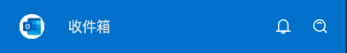

# Step3-1: Header



## Source Code

```rust
import { SText , SIcon} from "../modules/surrealism-ui/index.slint";
import { ROOT-GLOBAL } from "../global.slint";

export component Header inherits Rectangle{
  height: 60px;
  background: ROOT-GLOBAL.theme-color;
  HorizontalLayout {
    padding: 16px;
    width: 100%;
    HorizontalLayout {
      width: logo-wrapper.width + header-txt.width;
      alignment: space-between;
      logo-wrapper:= Rectangle {
        width: 40px;
        Rectangle {
          height: logo.height;
          width: logo.width;
          border-radius: self.height / 2; 
          clip: true;
          background: #fff;
          logo:= SIcon {
            height: 28px;
            width: 28px;
            source: ROOT-GLOBAL.icons.logo;
          }
        }
      }
      header-txt:= SText {
        horizontal-alignment: center;
        width: 90px;
        text: "收件箱";
      }
    }
    HorizontalLayout {
      alignment: end;
      HorizontalLayout {
        spacing: 18px;
        alignment: center;
        Rectangle {
          SIcon {
            height: 18px;
            width: 18px;
            source: ROOT-GLOBAL.icons.header.remind;
          }
        }
        Rectangle {
          SIcon {
            height: 18px;
            width: 18px;
            source: ROOT-GLOBAL.icons.header.search;
          }
        }
      }
    }
  }
}
  

```