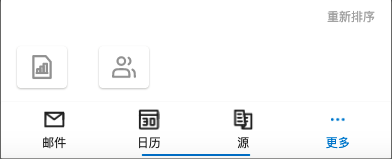

# Step3-2: Tabbar



## Source Code

```rust
    tabbar-drawer:= SDrawer {
        position: Bottom;
        proportion: 14%;
        drawer-layout:= VerticalLayout {
          padding-top: 8px;
          padding-left: 16px;
          padding-right: 16px;
          alignment: LayoutAlignment.space-between;
          SText{
            height: 16px;
            text: "重新排序";
            font-size: 12px;
            width: 100%;
            horizontal-alignment: TextHorizontalAlignment.right;
            color: #aaa;
          }
          Rectangle {
            height: drawer-layout.height - 16px;
            HorizontalLayout {
              spacing: 32px;
              height: icon-file-wrapper.height;
              icon-file-wrapper:= SCard {
                theme: Light;
                card-height: icon-file.height;
                card-width: icon-file.width;
                padding-type: Small;
                icon-file:= SIcon {
                  height: 26px;
                  width: 26px;
                  source: ROOT-GLOBAL.icons.tabbar.file.unclicked;
                }
              }
              SCard{
                theme: Light;
                card-height: icon-connection.height;
                card-width: icon-connection.width;
                padding-type: Small;
                icon-connection:=SIcon {
                  height: 26px;
                  width: 26px;
                  source: ROOT-GLOBAL.icons.tabbar.connection.unclicked;
                }
              }
            }
          }
        }
      }
    }
    tabbar:= STabbar{
      active: 1;
      theme: Light;
      border-radius: 0;
      private property <bool> is-more <=> tabbar-drawer.is-show;
      tabs: [
        {
          id: "1",
          icon: ROOT-GLOBAL.icons.tabbar.email.unclicked,
          name: "邮件",
        },
        {
          id: "2",
          icon: ROOT-GLOBAL.icons.tabbar.calendar.unclicked,
          name: "日历",
        },
        {
          id: "3",
          icon: ROOT-GLOBAL.icons.tabbar.source.unclicked,
          name: "源",
        },
        {
          id: "4",
          icon: ROOT-GLOBAL.icons.tabbar.more.unclicked,
          name: "更多",
        }
      ];
      // todo!(callback clicked)
      change(item) => { 
        // if self.is-more{
        //   tabbar-drawer.close();
        // }
        if item.id == "4"{
          tabbar-drawer.open();
        }else{
          tabbar-drawer.close();
        }
      }
    } 
```