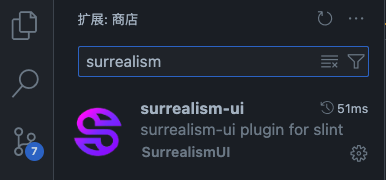
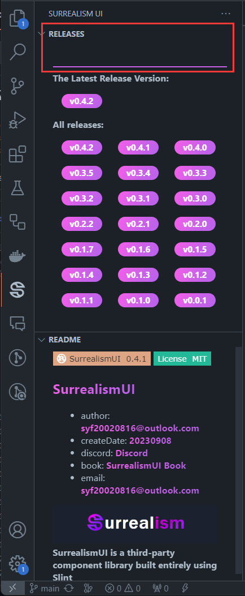

# SurrealismUI Plugin

A Plugin help you quickly init Slint + SurrealismUI (latest version) project

## QuickStart

### 1. install plugin 

you can directly install in VSCode Plugin

### 2. set download src

add download src (where you wanna store your project)

### 3. choose latest version and wait

click latest version tag and wait a moment...

you will get a zip which is the latest Slint + SurrealismUI Init Project Template

## Warning 

you need to keep your network open and can access Github normally